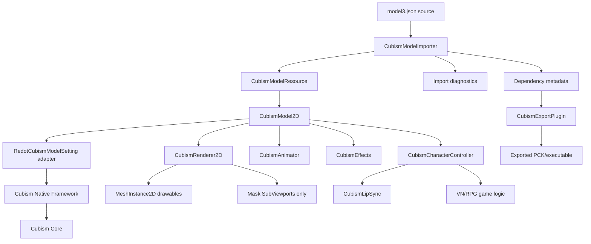
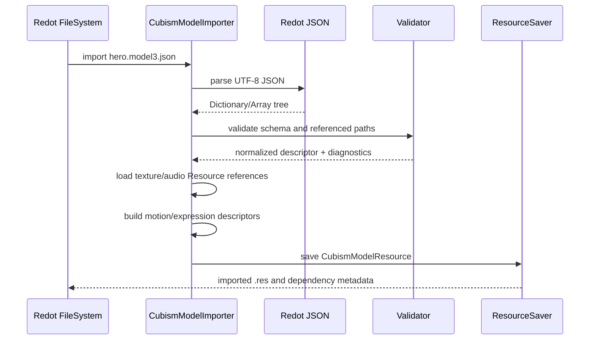
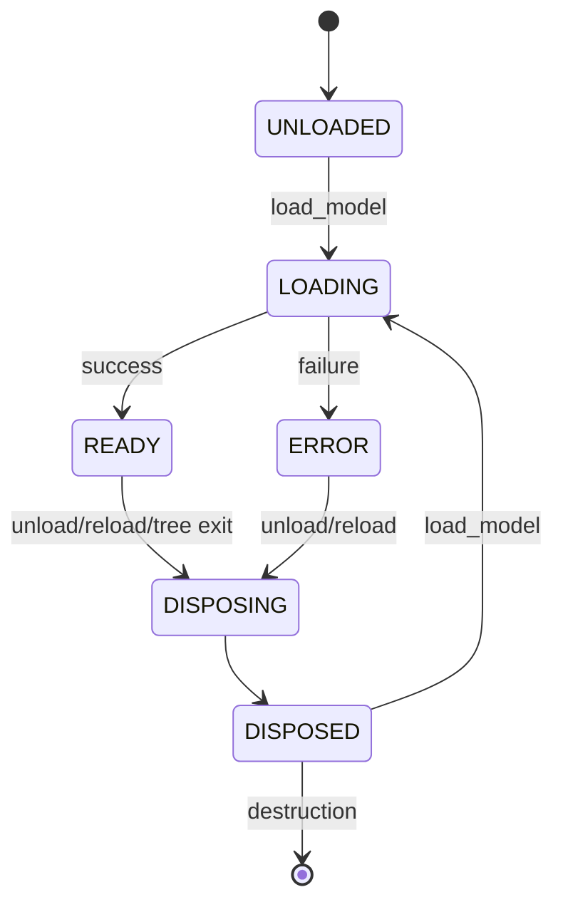

# Redot Live2D Cubism Importer and Runtime
## Codex Implementation Plan

**Status:** Implementation authorized; matched SDK provisioned, native compatibility tests in progress  
**Research snapshot:** 2026-09-07  
**Primary target:** Redot Engine LTS 26.2, Windows x86_64  
**Secondary target:** Redot Engine LTS 26.2, Linux x86_64  
**Implementation form:** External C++ GDExtension/addon, not an engine-core module  
**Working directory:** `plugins/redot-cubism`  
**Authorized remote:** `dominicbytes/redot_cubism` (user-created fork, verified 2026-09-07; supersedes the proposed hyphenated name)  
**Upstream starting point:** `MizunagiKB/gd_cubism`  
**Intended users:** Visual-novel, 2D RPG, dialogue, portrait, and character-driven Redot projects

---

# 1. Codex execution directive

Read this document completely before changing code. This document defines the port contract, not a completion claim. Implementation status and authorization are recorded in [the handoff](docs/gamedev/implementation-plan.md); stage reports record actual test evidence. Preserve the planning artifacts alongside upstream source.

## Review changes and execution boundary (2026-09-07)

Keep the existing native GDExtension approach. The source review found no demonstrated need for an engine-core module, but native load/render/export compatibility remains untested. Detailed evidence, unavailable checks, and open gates are in [the preflight report](docs/gamedev/preflight-report.md); the source/risk index is [source-of-truth.xlsx](docs/gamedev/source-of-truth.xlsx). This file remains the canonical implementation plan.

| Finding | Revision | Verification gate |
|---|---|---|
| R5 is pinned before the PR that migrates to R5 | Put required R5 compile adaptations in PR 2B; reserve PR 3 for lifecycle behavior | Matched R5 build, model playback, and diagnostic metadata |
| A port was coupled to importer/controller/timeline redesign | Add a bounded native-port milestone; keep later product milestones explicit | Legacy API and clean exported desktop smoke |
| Version names alone do not prove native ABI compatibility | Pin engine API dump, interface/header provenance, precision, toolchain, Core package and Framework | SDK-free extension load before Cubism is linked |
| Multi-part importer suffix support was inferred from only one path | Verify discovery, selection, first import and restart on stock Redot | Fresh-cache editor tests without claiming generic JSON |
| Raw path arrays do not register dependency watches | Add dependency fingerprints, reverse index, and explicit reimport scheduling | Change/delete/restore each dependency with manifest untouched |
| Export callback was assumed to cancel an export | Separate file injection from a checked export entry point | Missing asset prevents a release output, with nonzero status |
| Proposed API conflicts with engine naming and asynchronous behavior | Preserve Node.process_mode; use playback_process_mode, safe animation keys and speech handles | Binding/await/cancellation tests |
| Layout and effect ownership were incomplete | Preserve Layout and native motion/blink semantics | Compare transforms, eye curves and hit tests with official runtime |
| Imported paths could indirectly load scripts | Restrict manifest texture/audio paths before ResourceLoader | Script-bearing resources rejected before load |
| Optional work was a dependency of desktop release | Split native playback from P1 timeline work; move export earlier | P0 release graph excludes macOS, C#, mobile and timeline conversion |

The user has now requested implementation, testing, creation of the `dominicbytes/redot-cubism` fork and saving the source port there. Continue that authorized work without repeated approval. On 2026-09-07 the user also authorized downloading the SDK from Live2D's official website, superseding the earlier manual-provisioning restriction. Restricted asset redistribution and binary-publication decisions remain governed by Section 4.

The user subsequently created `dominicbytes/redot_cubism` and selected that
existing fork as the destination. Use its underscore spelling for Git remotes
and publication; keep the local plugin directory name unchanged.

Implement the work as a sequence of small, reviewable pull requests. Keep every merged PR buildable. Do not combine the initial Redot port, renderer redesign, model importer, high-level gameplay API, and mobile support into one PR.

## Non-negotiable rules

1. **Do not commit any proprietary Live2D Cubism Core binary, header bundle, SDK archive, sample model, or other file whose redistribution has not been explicitly approved.**
2. **Obtain the pinned Cubism SDK only from Live2D's official download page, as authorized by the user.** Accepting the page's license agreements through browser automation requires explicit action-time confirmation. Keep the package local and record its identity before use.
3. Preserve the original GDCubism copyright and MIT attribution for all derived code.
4. Pin all initial dependencies to the versions and commits in this document. Do not silently upgrade them.
5. Use Redot's `redot-cpp` binding, not upstream `godot-cpp`, for production builds.
6. Keep the initial port outside `redot-engine`. Open an engine PR only when a minimal reproduction proves an engine API or engine bug blocks the addon.
7. Do not expose raw Cubism pointers to GDScript or C#.
8. All asset paths must be treated as untrusted input.
9. Every PR must include:
   - tests for the behavior it adds or changes;
   - documentation for public behavior;
   - exact commands run;
   - exact dependency revisions;
   - a list of skipped tests and why they were skipped;
   - confirmation that no restricted SDK files entered Git history or build artifacts.
10. A public-CI job that skips SDK-dependent tests is not sufficient for release. A licensed private/self-hosted SDK test job must pass before release.
11. Preserve compatibility with existing GDCubism projects during the port. Introduce preferred Redot-facing class names through wrappers or compatibility aliases rather than performing an immediate destructive rename.
12. Confirm command-line switches against `redot --help` on the pinned Redot build before scripting them. Do not assume a Godot-only command-line option exists in Redot.

## Required completion report for every PR

At the end of each PR, produce:

````markdown
## PR completion report

### Summary
...

### Commits
- `<sha>` `<message>`

### Files changed
...

### Commands run
```text
...
```

### Test results
| Test suite | Result | Notes |
|---|---:|---|
| ... | PASS/FAIL/SKIP | ... |

### Dependency revisions
- Redot:
- redot-cpp:
- GDCubism baseline:
- Cubism SDK:
- Cubism Native Framework:

### Skipped or unavailable validation
...

### Remaining risks
...

### Proprietary-file audit
- `tools/check_restricted_files.py`: PASS/FAIL
- Restricted SDK files in Git: NO/YES
- Restricted SDK files in published artifacts: NO/YES/APPROVED
````

---

# 2. Executive decision

Build a **Redot-specific Cubism GDExtension** by porting GDCubism, then add a first-class Redot import pipeline around it.

The architecture must preserve the Cubism runtime. It must not flatten a Live2D model into static sprites or attempt to convert all Cubism behavior into ordinary Redot keyframes. The Cubism runtime remains responsible for model deformation, model parameters, expressions, physics, pose evaluation, masks, and model updates. Redot remains responsible for asset import, scene integration, rendering submission, input, audio, exported-project packaging, gameplay control, and editor tooling.

The target user experience is:

1. Install the addon into a Redot 26.2 project.
2. Copy a legally licensed Cubism model folder into `res://`.
3. Redot recognizes `*.model3.json`.
4. The importer creates a `CubismModelResource`.
5. Create `CubismModel2D` and assign the imported resource in the inspector. Direct dragging into the 2D scene viewport requires explicit editor drop handling and is a later convenience feature.
6. Preview the model in the editor.
7. Play motions and expressions by stable names.
8. Use optional blink, breath, look-target, physics, pose, hit-area, and lip-sync behavior.
9. Export the game without manually adding model folders to export filters.
10. Run the exported visual novel or RPG with the same model behavior as the editor.

---

# 3. Pinned research baseline

Use these source revisions for the first implementation branch. They are source-verified pins, not a successful build matrix. Complete the package/toolchain fields in PR 0 before the SDK-dependent PR 2B.

| Dependency | Required baseline | Pin |
|---|---|---|
| Redot Engine | Redot LTS 26.2 stable | tag `redot-26.2-stable`, commit `4f5b14abade2239104847d03d8f9056e4467cfcd` |
| Redot compatibility base | Godot API baseline recorded by Redot | 4.5.2 |
| redot-cpp | Redot 26.2 branch | commit `598ec78e86b2c240a023f6de13daba70f7de8610` |
| GDCubism | v0.9.1 source baseline | commit `3aaa3c9001808732c40aa3fa07460a95125d9ccc` |
| Cubism SDK for Native / Core | Matched R5 package | `5-r.5`; exact vendor archive filename, SHA-256, Core version and per-platform library hashes must be recorded from the lawfully provisioned package in PR 0 |
| Cubism Native Framework | Stable R5 source | tag `5-r.5`, commit `145155d2c5bdd8d23475cef9cc3ab46d3220190c` |
| C++ language level | Match Redot 26.2/redot-cpp requirements | determine from pinned build configuration and record |
| SCons/Python/compiler | Match Redot 26.2-supported toolchain | pin in CI after the build spike; do not inherit GDCubism's old SCons recommendation without revalidation |

## Why these pins matter

- Redot 26.2 identifies an underlying Godot compatibility baseline of 4.5.2.
- `redot-cpp` warns that its development branch must match Redot's development branch and recommends pinning a matching stable revision.
- The pinned GDCubism tree records `godot-cpp` gitlink `fbbf9ec4efd8f1055d00edb8d926eef8ba4c2cce`. Replace the gitlink URL and revision, not merely the branch label in `.gitmodules`. Its documentation shows SDK 5-r.1; that is historical context, not permission to mix R1 Core with R5 Framework.
- GDCubism v0.9.1 contains direct 2D rendering and useful runtime functionality, but it also calls APIs removed or changed in Cubism Native Framework 5-r.5.
- R5 is the selected SDK baseline and removes APIs used by this upstream tree. Its fixes to official graphics backends do not automatically fix the custom Redot renderer. Keep Core and Framework matched, and migrate the required calls before the first full addon build.

Do not silently move a pin. If a pin is invalid or cannot meet a verified requirement, document the blocker and propose the smallest isolated pin correction; do not require an impossible successful build of that pin before correcting it. Other upgrades remain separate PRs.

### Native build identity

- Resolve an executable `REDOT_BIN` on the actual host and record `--version`, `--help`, binary SHA-256 and matching export-template hashes. `GODOT_BIN`, when required by helpers, must point to that same executable.
- After verifying supported switches, generate `extension_api.json` from the exact stock target editor in a temporary directory using `--dump-extension-api`. Supply its absolute path with the pinned binding's `custom_api_file` option. Record the dump hash and both Redot and Godot compatibility version fields. Retain the pinned Redot-specific interface header; verify it matches the target interface.
- Use `precision=single` for the initial stock desktop targets. Match the addon, bindings, API dump and engine precision. Double precision is not advertised and requires separate buffer-layout/ABI tests.
- `redot-cpp` still uses `godot_cpp` include paths, `godot::` and Godot-named build helpers. Do not mechanically rename those symbols. Its initialization explicitly requires `get_redot_version`.
- Record exact Python, SCons, compiler/linker and standard-library versions plus all build flags. Keep separate object/cache/output directories for platform, architecture, target, API hash, precision and SDK identity.
- This review could not fetch the oversized binding API JSON through the connector or run the Windows editor on this Linux host. PR 2A must validate the generated API and a minimal extension before any claim of binary compatibility.

---

# 4. Legal and distribution gate

This section is a release blocker, not optional documentation.

## 4.1 Components with different licenses

| Component | Expected treatment |
|---|---|
| Redot Engine | Follow Redot's license and attribution requirements |
| redot-cpp | Follow its license and preserve notices |
| GDCubism-derived source | MIT; preserve upstream notices and identify modifications |
| Cubism Native Framework | Follow the Live2D Open Software License and included notices |
| Cubism Core | Proprietary; do not publish it casually or commit it to this repository |
| Cubism sample models | Separate model-specific terms; do not assume redistribution permission |
| User-created models | User is responsible for model rights and applicable Live2D terms |
| Published addon/tool | Requires a human review of Live2D SDK publication terms |

## 4.2 Expandable-application risk

A general-purpose Redot addon that lets downstream users load arbitrary Live2D models may be treated differently from a single finished game. Live2D describes software with significant end-user expandability as an **Expandable Application** and states that such applications require review and a special publication agreement before release.

Therefore:

- Development and private verification may proceed with a lawfully obtained SDK.
- **Do not publish a binary addon containing or linked to redistributable Cubism components until a human has confirmed the applicable Live2D publication/license path.**
- Add a release checklist item requiring written confirmation or an archived decision from Live2D or qualified legal counsel.
- Do not encode a legal conclusion in source comments.
- Do not state that the addon is royalty-free or publication-exempt.
- Source-only publication may also need review because the intended product is a general-purpose integration. Treat it as a human decision.
- The final repository README must clearly separate:
  - source-code license;
  - Cubism SDK license;
  - Cubism Core distribution;
  - model asset licensing;
  - game/application publication obligations.

## 4.3 Repository protections

Add all of the following in PR 1:

```gitignore
# Proprietary/local Cubism SDK packages
thirdparty/CubismSdkForNative-*/
thirdparty/CubismSdkForNative*/
thirdparty/cubism-sdk/
thirdparty/cubism-core/
.local-sdk/
.private-fixtures/
*.moc3
```

The broad `*.moc3` rule may be overridden only inside a separately reviewed, explicitly licensed test-fixture directory.

Add:

- `tools/check_restricted_files.py`
- `tools/check_release_archive.py`
- a pre-commit hook;
- a CI job;
- a release-workflow gate.

The scanner must detect at least:

- `Live2DCubismCore` libraries;
- `CubismSdkForNative` directories or archives;
- `.moc3` files;
- common official sample-model names;
- Core headers copied outside an approved local SDK directory;
- SDK ZIP/TAR archives;
- unexpected `.dll`, `.so`, `.dylib`, `.a`, `.lib`, `.framework`, and `.aar` files.

Do not rely only on filenames. Also scan archive member names and known identifying strings.

Use distinct audit modes: (a) source repository/history and source archives, (b) approved addon binaries, and (c) finished game/private test exports. A legitimate game or private test PCK must contain its licensed MOC and raw dependencies. The public addon archive must not accidentally contain test models or SDK source. Statically linked Core code remains part of an addon binary even if no separate Core library is shipped; a filename scan cannot establish redistribution rights. Use exact approved paths/hashes and provenance rather than blanket allowances for all native binaries.

Audit upstream history before promising to preserve it wholesale. If restricted content exists in historical commits, stop public publication and prepare a scoped provenance-preserving import proposal; do not silently publish it or rewrite upstream history. Source-only preparation does not require a publication decision just to begin local work.

---

# 5. Product requirements

## 5.0 Native port milestone (before new product features)

The first useful result is the existing GDCubism runtime rebuilt for Redot 26.2 and R5, retaining its public class names, effect nodes, `assets` property, shader paths and scene compatibility. Require Windows and Linux x86_64 debug/release load, a licensed model rendered and animated through the legacy API, editor Node2D smoke, teardown and a privately exported smoke project launched without the development tree. Record known upstream defects and fix port-blocking ones; do not call this milestone the full P0 release.

This milestone does not depend on `CubismModelResource`, new class names, Animation conversion, a controller, macOS, C# or mobile. It may use explicit fixture export filters in its test project until PR 9 replaces them. Never carry that workaround into the P0 installation guide.

## 5.1 P0: first stable desktop release

The first release is complete only when all of these work on Windows x86_64 and Linux x86_64:

- Redot 26.2 loads the extension without errors.
- A clean editor project can enable/load the addon and create ordinary `Node2D` scenes without crashing.
- `*.model3.json` is recognized as a Cubism model source.
- Import errors identify the exact invalid or missing referenced file.
- Unicode paths, spaces, and non-ASCII filenames work where the operating system and Redot support them.
- The imported resource tracks model dependencies and reimports when a dependency changes.
- A `CubismModel2D` node can render the model directly as 2D meshes.
- Model transforms work: position, rotation, scale, negative scale, visibility, modulation, and parent transforms.
- Normal, additive, and multiplicative drawables render correctly.
- Regular and inverted masks render correctly.
- Motions, expressions, physics, pose, blink, breath, target/look behavior, and hit areas work.
- Multiple models can overlap without body parts from different characters interleaving.
- A user script may override `_process()` without stopping the native model update.
- Motion completion and motion-event signals fire deterministically and exactly once where applicable.
- A simple audio-envelope lip-sync component drives mouth parameters.
- The project exports without manual wildcard/resource-filter workarounds.
- The exported executable loads the same model and dependencies.
- Repeated model load/unload does not leak addon-owned resources.
- The addon ships with a visual-novel example and a 2D RPG/dialogue example.
- GDScript API documentation is complete.
- Public CI and licensed private CI both pass.

## 5.2 P1: supported expansion

- macOS x86_64 and arm64.
- Redot Mono/C# smoke-tested wrapper API.
- Imported Cubism motions exposed as Redot `Animation` resources.
- `AnimationLibrary` generation for each model.
- Motion discovery outside the model manifest as an opt-in import option.
- Editor dock for model inspection, motions, expressions, hit areas, and parameters.
- Configurable performance profiles.
- Better diagnostic reports and one-click model validation.
- Packaging automation for approved binary releases.

P1 timeline conversion, inspection dock, macOS and C# work are independent follow-ups. They are not prerequisites for the P0 desktop release. C#/.NET and additional platforms require a later explicit implementation request in this workspace.

## 5.3 P2: experimental expansion

- Android arm64.
- iOS arm64.
- Optional per-model SubViewport rendering mode for special composition cases.
- Sprite3D/billboard bridge.
- Offline or phoneme-driven lip-sync metadata.
- Advanced model streaming/user-supplied models, only after a separate security and license review.
- Web only if both Redot GDExtension/Web support and Cubism licensing/runtime support are proven for the chosen build.

---

# 6. Explicit non-goals for the initial release

Do not include these in the first stable release:

- Cubism Editor authoring or rigging inside Redot.
- Importing `.cmo3` or `.can3` editor-project files.
- Replacing the Cubism runtime with Redot-only mesh deformation.
- Baking every Live2D animation to spritesheets.
- Webcam or face-tracking software.
- A complete VTuber application.
- Network download of arbitrary models.
- Runtime loading from unrestricted paths outside `res://` or approved user-data locations.
- Console-platform support.
- 3D world rendering as a core requirement.
- MotionSync/CRI integration.
- Machine-learning phoneme recognition.
- A Redot engine-core patch without a minimal blocker reproduction.
- Support for Redot versions earlier than 26.2.

---

# 7. Target architecture



## 7.1 Component responsibilities

### `CubismModelImporter`

- Recognizes the complete suffix `model3.json`.
- Parses JSON with Redot's JSON implementation.
- Resolves all model references without depending on Cubism's path decoding.
- Validates paths and files.
- Produces a deterministic `CubismModelResource`.
- Records source dependencies and diagnostics; the editor plugin maintains the reimport index described in Section 9.7.
- Never executes model scripts or accesses the network.

### `CubismModelResource`

A serializable Redot `Resource` containing normalized model metadata and resource references. It must not contain live Cubism pointers or renderer objects.

### `RedotCubismModelSetting`

An adapter between imported Redot metadata and Live2D's `ICubismModelSetting` interface. This removes the need to use `CubismModelSettingJson` for filesystem path resolution and fixes Unicode/path-control problems.

Implement the entire pinned interface, including layout. Store returned UTF-8 filenames/names in adapter-owned immutable buffers that outlive all Framework reads; never return a pointer from a temporary `String.utf8()` conversion. Preserve ordered texture/motion indices, valid empty strings for absent optional values and Framework-managed ID handles. Each runtime owns its adapter; it must not mutate the shared imported Resource.

### `CubismModel2D`

The preferred public `Node2D`. It owns one model runtime, animator, effect pipeline, renderer resources, and lifecycle state.

### Legacy `GDCubismUserModel`

Keep the upstream class functional during migration. It may:

- subclass the new implementation;
- delegate to it;
- or remain temporarily while `CubismModel2D` wraps it.

Mark its raw `assets: String` path API deprecated only after the imported resource path is stable.

### `CubismRenderer2D`

Translates current Cubism drawables into Redot `ArrayMesh`, `MeshInstance2D`, shader, texture, and mask resources.

### `CubismAnimator`

Owns deterministic motion/expression state, update ordering, playback speed, priorities, transitions, callbacks, and optional Redot `AnimationPlayer` integration.

### `CubismCharacterController`

A high-level VN/RPG-facing API that provides named actions and coordinates voice playback, expression, motion, look target, and lip sync.

### `CubismExportPlugin`

Injects nonstandard raw dependencies for included model resources into exports. A separate checked export entry point validates the same dependency closure before invoking export and rejects invalid output; see Section 17.5. Do not assume that an EditorExportPlugin callback can cancel export.

---

# 8. Public resource and class design

Names may be adjusted after the API review, but the behavior and separation must remain.

## 8.1 `CubismModelResource`

```text
CubismModelResource : Resource
```

Required fields:

| Field | Type | Purpose |
|---|---|---|
| `source_model_path` | `String` | Original `res://...model3.json` path; editor/debug metadata |
| `source_hash` | `String` | Stable hash of the source manifest |
| `moc_path` | `String` | Normalized `res://` path |
| `moc_version` | enum/int | Detected MOC format version where available |
| `texture_paths` | `PackedStringArray` | Ordered paths matching Cubism texture indices |
| `layout` | `Dictionary` of finite numeric values | Preserve manifest `Layout` and provide the complete R5 `GetLayoutMap` contract |
| `dependency_fingerprints` | `Dictionary` | Path to content hash or explicit missing marker, including optional references |
| `textures` | `Array[Texture2D]` | Redot resource dependencies, ordered by texture index |
| `motion_groups` | `Dictionary` | Group name to ordered motion descriptors |
| `expressions` | `Array` or typed resources | Expression descriptors |
| `physics_path` | `String` | Optional normalized path |
| `pose_path` | `String` | Optional normalized path |
| `user_data_path` | `String` | Optional normalized path |
| `display_info_path` | `String` | Optional normalized path |
| `hit_areas` | typed array | ID/name mappings from the manifest |
| `eye_blink_parameter_ids` | `PackedStringArray` | Parameter group membership |
| `lip_sync_parameter_ids` | `PackedStringArray` | Parameter group membership |
| `canvas_size` | `Vector2` | Filled after runtime validation or import validation |
| `canvas_origin` | `Vector2` | Filled after runtime validation or import validation |
| `pixels_per_unit` | `float` | Cubism canvas scale |
| `dependency_paths` | `PackedStringArray` | Sorted, unique complete dependency set |
| `import_warnings` | `PackedStringArray` | Nonfatal diagnostics |
| `import_schema_version` | `int` | Increment when serialization changes |
| `sdk_compatibility` | `Dictionary` | SDK/MOC compatibility metadata |
| `import_options` | `Dictionary` | Relevant options used to produce the resource |

Do not serialize:

- `CubismMoc *`;
- `CubismModel *`;
- `CubismMotion *`;
- renderer RIDs;
- `MeshInstance2D` nodes;
- raw allocator addresses;
- editor-only pointers.

## 8.2 Motion descriptor

```text
CubismMotionDescriptor : Resource
```

Required fields:

- `id: StringName`
- `group: StringName`
- `index: int`
- `source_path: String`
- `sound_path: String`
- `sound: AudioStream` when present; a real imported resource reference for export remapping
- `fade_in_seconds: float`
- `fade_out_seconds: float`
- `duration_seconds: float`
- `loop: bool`
- `animation: Animation` when conversion is enabled
- `events: Array[CubismMotionEvent]`
- `metadata: Dictionary`

Stable ID rule:

```text
<group>/<manifest-index>
```

These IDs are deterministic within a manifest revision. Reordering the manifest changes index-based identities. Save data must include model identity/revision and reject or explicitly migrate stale IDs. When a source provides a useful unique filename, expose a friendly alias without replacing the ID. Do not use these slash-containing IDs directly as AnimationLibrary entry names (Section 14.3).

## 8.3 Expression descriptor

```text
CubismExpressionDescriptor : Resource
```

Required fields:

- `id: StringName`
- `source_path: String`
- `fade_in_seconds: float`
- `fade_out_seconds: float`
- `parameters: Array[CubismExpressionParameter]`

Expression operation enum:

- `ADD`
- `MULTIPLY`
- `OVERWRITE`

## 8.4 Preferred runtime node

```text
CubismModel2D : Node2D
```

Required inspector properties:

```text
Model
  model: CubismModelResource
  autoplay: bool
  default_motion: StringName
  default_expression: StringName

Playback
  playback_process_mode: IDLE | PHYSICS | MANUAL
  speed_scale: float
  paused: bool
  deterministic_seed: int

Effects
  enable_eye_blink: bool
  enable_breath: bool
  enable_physics: bool
  enable_pose: bool
  enable_look_target: bool
  enable_lip_sync: bool

Rendering
  rendering_mode: DIRECT | SUBVIEWPORT_FALLBACK
  mask_quality: LOW | MEDIUM | HIGH | CUSTOM
  custom_mask_limit: int
  offscreen_update_mode: ALWAYS | REDUCED | PAUSED
  premultiplied_alpha: bool
  debug_draw_bounds: bool
  debug_draw_hit_areas: bool
```

Keep inherited `Node.process_mode` for scene-tree pause behavior; do not redeclare or bind it as a Cubism playback enum.

Required state:

```text
UNLOADED
LOADING
READY
ERROR
DISPOSING
DISPOSED
```

Required methods:

```gdscript
func load_model(resource: CubismModelResource) -> Error
func unload_model() -> void
func reload_model() -> Error
func is_ready() -> bool
func get_last_error() -> String

func play_motion(
    motion_id: StringName,
    priority: CubismMotionPriority = CubismMotionPriority.NORMAL,
    loop: bool = false,
    speed: float = 1.0
) -> CubismMotionHandle

func play_motion_from_group(
    group: StringName,
    index: int,
    priority: CubismMotionPriority = CubismMotionPriority.NORMAL,
    loop: bool = false,
    speed: float = 1.0
) -> CubismMotionHandle

func stop_motion(fade_out_seconds: float = -1.0) -> void
func set_expression(expression_id: StringName, fade_seconds: float = -1.0) -> Error
func clear_expression(fade_seconds: float = -1.0) -> void

func has_parameter(id: StringName) -> bool
func get_parameter_value(id: StringName) -> float
func set_parameter_value(id: StringName, value: float, weight: float = 1.0) -> Error
func add_parameter_value(id: StringName, value: float, weight: float = 1.0) -> Error
func multiply_parameter_value(id: StringName, value: float, weight: float = 1.0) -> Error

func set_part_opacity(id: StringName, opacity: float) -> Error
func set_look_target(local_target: Vector2, weight: float = 1.0) -> void
func clear_look_target() -> void

func get_motion_ids() -> PackedStringArray
func get_expression_ids() -> PackedStringArray
func get_parameter_ids() -> PackedStringArray
func get_part_ids() -> PackedStringArray
func get_hit_area_names() -> PackedStringArray
func hit_test(hit_area: StringName, local_point: Vector2) -> bool

func advance(delta: float) -> void
```

Required signals:

```gdscript
signal model_load_started(resource)
signal model_ready(resource)
signal model_failed(error_code, message)
signal motion_started(handle, motion_id)
signal motion_event(handle, event_value)
signal motion_looped(handle, loop_count)
signal motion_finished(handle, motion_id, reason)
signal expression_changed(expression_id)
signal hit_area_entered(hit_area)
signal hit_area_exited(hit_area)
signal runtime_warning(code, message)
```

`motion_finished` must fire exactly once on terminal transition for every accepted handle, including a looping handle when stopped, interrupted or unloaded. Loop boundaries emit `motion_looped`, not terminal completion. Stopped, interrupted, completed, unloaded, reloaded and error reasons must be distinguishable.

## 8.5 High-level controller

### Authored animation cues, with or without recorded audio

Developer intent confirmed during review: create animations in Cubism Editor, export `.motion3.json`, assign them to game/dialogue cues, and play them either with a prerecorded voice line or without audio. Animation authoring/recording remains in Cubism Editor or the developer's external pipeline; the Redot addon loads and plays the exported motions. The existing non-goal for in-engine authoring remains.

- `perform(motion_id, expression_id)` plays a cue without starting audio. A motion's optional manifest `Sound` association is preserved as metadata; it does not make every low-level motion call audibly play a sound.
- `speak(stream, motion_id, expression_id, profile)` coordinates prerecorded audio with the assigned motion. When a stream is explicitly provided it takes precedence over any descriptor sound; a documented helper may use the descriptor sound when requested.
- Support authored/baked mouth animation and optional volume-driven lip sync as distinct policies. Authored mouth curves win by default when used for a timed voice performance; disable envelope writes for those parameters unless the developer explicitly selects a blend. Cubism Editor can bake motion-sync into ordinary animation curves; playback of those exported curves does not require adding the separate runtime MotionSync plugin to this port.
- For synchronized voice performances, define cue start offset and a single playback-time authority. Use the audio playback clock/latency estimate to coordinate motion time and detect drift; do not assume that calling two play methods in the same frame guarantees ongoing sync. Keep the first supported mode at normal playback speed and define pause/resume, interruption and unequal-duration behavior. Native motion updates still respect finite bounded deltas; seeking/backward jumps need an explicit reset/replay policy before support is advertised.
- Acceptance: one voiced cue with authored mouth timing, the same motion with no audio, an idle/reaction cue, a voice-only cue with envelope lip sync, and pause/interruption cases. Record cue alignment and drift over a long line at multiple frame rates against a declared time tolerance, plus a fake audio-clock test independent of audio hardware. Do not claim sample-accurate synchronization from an envelope alone.

References: [record parameter operations in Cubism Editor](https://docs.live2d.com/en/cubism-editor-manual/recording-parameters/), [author scenes with audio](https://docs.live2d.com/en/cubism-editor-manual/generating-scene-from-audio-file/), [runtime export formats](https://docs.live2d.com/en/cubism-editor-manual/export-moc3-motion3-files/), [motion-sync baking](https://docs.live2d.com/en/cubism-editor-manual/motion-sync-bake/), and [Native WAV lip-sync sample](https://docs.live2d.com/en/cubism-sdk-tutorials/native-lipsync-from-wav-native/).

```text
CubismCharacterController : Node
```

Methods:

```gdscript
func show_character(transition := "none") -> void
func hide_character(transition := "none") -> void
func perform(motion_id: StringName, expression_id := &"") -> void
func speak(
    stream: AudioStream,
    motion_id := &"",
    expression_id := &"",
    lip_sync_profile: CubismLipSyncProfile = null
) -> CubismSpeechHandle
func stop_speaking(fade_seconds := 0.1) -> void
func look_at_screen_position(position: Vector2) -> void
func return_to_idle() -> void
```

The controller must not duplicate the low-level runtime. It orchestrates `CubismModel2D`, `AudioStreamPlayer`, and `CubismLipSync`.

`CubismSpeechHandle : RefCounted` owns a terminal result and a `finished(reason)` signal, but no native model pointer. Completion, interruption, hide/unload and error each terminate once. Callers check terminal state before awaiting, so an immediate failure cannot strand an await. A motion ending does not finish speech while the voice is still playing; controller destruction terminates outstanding speech handles.

## 8.6 Lip-sync component

```text
CubismLipSync : Node
```

P0 modes:

- `MANUAL_VALUE`
- `AUDIO_BUS_PEAK`

Required settings:

- target model;
- target parameter IDs;
- gain;
- noise gate;
- attack;
- release;
- minimum;
- maximum;
- optional mouth-form parameter;
- deterministic manual sample input for tests.

Do not depend on a microphone or audio device in automated tests. Tests must be able to submit a known sequence of amplitude samples.

Phoneme/viseme support is P2.

---

# 9. Import pipeline

## 9.1 Recognized source suffix

Return `model3.json` from `EditorImportPlugin._get_recognized_extensions()` without a leading dot.

The pinned `ResourceFormatImporter::get_importer_by_file()` and `EditorFileSystem::_can_import_file()` compare suffixes. However, discovery and UID scanning also use the final extension, and selection is priority-based rather than longest-suffix-based. Prove the complete editor workflow on a clean stock configuration; returning a string alone is insufficient. Keep a positive explicit importer priority and reject anything not ending in `.model3.json` at the parser entry point. Do not register a catch-all `json` importer just to make discovery work.

PR 2A must test discovery and any generic-JSON importer coexistence before PR 5. If a stock-editor discovery edge is blocked, document a minimal reproduction and use an explicit “Import Cubism Model” action that generates a separate resource as the provisional addon-only path; do not claim automatic recognition until it passes. Add an automated test proving that:

```text
hero.model3.json
```

uses the Cubism importer, while:

```text
hero.json
not_model3.json.backup
```

does not.

## 9.2 Import sequence



## 9.3 Manifest parsing rules

Parse with Redot JSON, not `CubismModelSettingJson`, for all filesystem references.

Support known Cubism keys while preserving unknown keys in an optional metadata dictionary:

- `Version`
- `FileReferences`
  - `Moc`
  - `Textures`
  - `Physics`
  - `Pose`
  - `DisplayInfo`
  - `UserData`
  - `Expressions`
  - `Motions`
- `Groups`
- `Layout` (finite numbers; preserve scaling/origin rules from Cubism)
- `HitAreas`
- motion-level `File`, `Sound`, `FadeInTime`, `FadeOutTime`
- expression-level `Name`, `File`

Rules:

1. Require the root to be a dictionary.
2. Require a supported model-settings version.
3. Require a nonempty MOC reference.
4. Require a texture array, but allow an empty array only as a warning if the model itself permits it.
5. Treat physics, pose, user data, display info, expressions, motions, and motion sound as optional.
6. Reject fields with the wrong JSON type when they affect runtime safety.
7. Preserve forward-compatible unknown fields and warn only when they may affect support.
8. Never use the platform's current working directory to resolve references.
9. Normalize `\` to `/` before Redot path normalization.
10. Decode UTF-8 through Redot strings.
11. Preserve case. Do not lowercase paths.
12. Detect duplicate motion/expression IDs and generate deterministic diagnostics.
13. Sort dependency output deterministically without changing texture or motion ordering.
14. Implement every pure virtual in the pinned `ICubismModelSetting`, including `GetLayoutMap`; apply layout through the model matrix and use the same coordinates for rendering and hit tests.
15. Explicitly reject non-finite numeric values before conversion into Framework floats; do not rely on Redot JSON being a strict validator for all numeric edge cases.

## 9.4 Path security rules

For every reference:

1. Resolve relative to the directory containing the source `model3.json`.
2. Normalize `.` and `..`.
3. Resolve the final project path.
4. Require it to remain inside the Redot project unless an explicit, separately reviewed runtime-user-data mode is active.
5. Reject:
   - absolute paths;
   - URI schemes;
   - drive-letter escapes;
   - UNC paths;
   - null bytes;
   - control characters;
   - project-root escapes;
   - symlinks that resolve outside the project, where the platform permits checking;
   - paths longer than the project's configured safety limit.
6. Provide the source JSON property path in the error:
   ```text
   FileReferences.Motions.TapBody[0].File
   ```
7. Set defensible limits:
   - maximum JSON file size;
   - maximum referenced files;
   - maximum textures;
   - maximum motion groups;
   - maximum motions per group;
   - maximum expression count;
   - maximum string length.
8. Start with documented fixed caps and bounded diagnostics. Add only a demonstrated project-setting override, capped by hard limits; do not build an unneeded configuration system.
9. Before calling `ResourceLoader`, allow only documented image/audio source extensions for manifest texture/sound references (initially PNG textures and WAV/OGG audio). Reject `.tres`, `.res`, `.tscn`, `.scn`, `.gd` and other script-bearing/custom resource sources in these fields. Verify the imported type afterward too; type checking only after loading is too late to support the no-script-execution guarantee. Other raw references must match their expected MOC/JSON suffix and schema.

## 9.5 Strict and lenient import modes

### Strict mode

Fail import for:

- missing MOC;
- missing texture;
- malformed required JSON;
- path escape;
- duplicate mandatory identifier;
- unsupported MOC version;
- invalid texture index mapping.

### Lenient mode

May continue with warnings for:

- missing optional physics;
- missing optional pose;
- missing optional expression;
- missing optional motion sound;
- unknown metadata fields;
- unreferenced extra motion files.

Default to strict mode for required runtime assets and lenient behavior for optional assets.

## 9.6 Import options

| Option | Default | Notes |
|---|---:|---|
| `validation/strict_optional_files` | false | Optional files warn by default |
| `motions/import_manifest_motions` | true | Catalog manifest motions |
| `motions/discover_unreferenced` | false | Opt-in directory scan |
| `motions/convert_to_redot_animation` | false | P1 only; reject true as unavailable until PR 6B is implemented |
| `expressions/import` | true | Catalog and validate expressions |
| `rendering/mask_quality` | medium | Converted to a platform-neutral resource setting |
| `rendering/premultiplied_alpha` | false initially | Change only after reference comparison |
| `textures/load_as_resources` | true, fixed in P0 | Required imported resource edges; not a user-disableable export dependency |
| `validation/check_moc_consistency` | true when SDK supports it | Guard with feature detection |
| `validation/maximum_file_count` | safe fixed default | Project setting may lower or raise within a hard cap |
| `compatibility/allow_newer_manifest_version` | false | Fail closed initially |
| `diagnostics/store_unknown_fields` | true | Supports future analysis |

## 9.7 Reimport behavior

A stored `PackedStringArray` is metadata, not an engine dependency watcher. `gen_files` in `_import()` lists generated output files; never put MOC/JSON source dependencies there, and never hand-edit engine-owned `.import`/`.md5` files.

Implement a concrete invalidation path:

1. Serialize real Texture2D/AudioStream resource references for engine import/remap/export behavior. Set `_can_import_threaded()` to false initially. Choose `_get_import_order()` after texture/audio imports; use the verified `append_import_external_resource()` API only when an actual missing imported resource requires it.
2. Store fingerprints of the manifest and complete referenced-file set, including paths missing under lenient policy. The fingerprint also includes import options, `_get_format_version()` and the relevant addon schema/version.
3. The native editor plugin builds a reverse index from raw dependency path to model manifest and checks hashes on startup, filesystem changes, resource-reimport signals and explicit validation. Raw `.moc3` or unknown JSON files may not emit a usable resource signal: check the bounded known dependency set on a documented editor poll/focus rescan too, including same-name content replacements.
4. Queue affected manifest paths via `EditorFileSystem.reimport_files()` on the main thread after the active scan/import ends. Deduplicate and guard against reentrant/infinite reimports; a successful import updates the fingerprints/index.
5. Reconstruct the index without cache files. Failed imports must retain discovered/missing paths in the editor index so restoring a dependency can recover. A stale or incomplete imported model fails checked export even if no editor event was received.
6. Test source moves and renames explicitly. Texture/audio resource UIDs may be remapped by Redot, but raw strings in Cubism JSON are not. If relative references break after a move, emit a precise error; do not silently rewrite the user's manifest.

Changing any of these must trigger reimport through that mechanism:

- source model JSON;
- MOC file;
- texture;
- motion JSON;
- expression JSON;
- physics JSON;
- pose JSON;
- user-data JSON;
- display-info JSON;
- referenced audio;
- import options;
- importer schema version;
- relevant addon version.

Tests must cover:

- content change with same filename;
- renamed dependency;
- deleted dependency;
- dependency restored after failure;
- texture reimport;
- import-option change;
- editor restart with existing `.import` metadata;
- source-control checkout where `.godot` is absent.

---

# 10. Runtime model loading

## 10.1 Replace path-sensitive Cubism settings parsing

The upstream loader currently creates `CubismModelSettingJson` from the raw manifest and obtains filenames from that object. This has a known Unicode-path failure mode.

Implement `RedotCubismModelSetting`, backed by `CubismModelResource`, and use it for:

- MOC file reference;
- texture paths;
- expressions;
- motions;
- physics;
- pose;
- user data;
- layout via `GetLayoutMap` and the Cubism model matrix;
- hit areas;
- eye-blink groups;
- lip-sync groups.

Do not work around Unicode by renaming user files, copying them to temporary ASCII directories, or modifying the source model manifest.

## 10.2 File loading

Use Redot `FileAccess` for raw MOC/JSON payloads and `ResourceLoader` for allowlisted imported textures/audio (Section 9.4). Copy/align MOC bytes as required by the exact Core/Framework entry point; do not assume arbitrary PackedByteArray storage satisfies a direct Core API alignment/lifetime contract.

All reads must return structured errors. Do not call Cubism with:

- an empty byte buffer;
- a null pointer from an empty `PackedByteArray`;
- a missing texture;
- a file larger than configured limits.

Before creating the runtime model:

1. Verify model resource validity.
2. Read MOC bytes.
3. Run the available Cubism consistency/version check.
4. Reject unsupported versions with an actionable message.
5. Load model.
6. Confirm model and model matrix pointers.
7. Load optional resources.
8. Create renderer.
9. Build initial drawable meshes.
10. transition to `READY`;
11. emit `model_ready`.

On failure:

- transition to `ERROR`;
- free any partially created state;
- preserve a useful error string;
- emit `model_failed`;
- remain safe to retry or unload.

## 10.3 Lifecycle state machine



Requirements:

- `clear()`/`dispose()` is idempotent.
- Destruction after a failed partial load is safe.
- Removing the node during a signal callback is safe.
- Reloading during playback cancels handles with an `UNLOADED` or `RELOADED` reason.
- Redot editor scene reload and extension unload do not leave registered loaders/plugins behind.
- Global `CubismFramework::StartUp/Initialize/Dispose` uses process-wide reference counting or one well-defined extension lifetime. Multiple model nodes must not initialize/dispose the framework independently.
- If Redot hot reload is enabled for development, explicitly test it. Otherwise set `reloadable = false` and document why.

## 10.4 Native notification handling

Use native `_notification()` for required work, preserving Node pause semantics. Prefer `set_process_internal()`/`set_physics_process_internal()` with internal notifications for playback so a script overriding a virtual callback or disabling its own regular processing cannot accidentally disable Cubism.

Use `_notification()` for:

- `NOTIFICATION_ENTER_TREE`;
- `NOTIFICATION_READY`;
- `NOTIFICATION_INTERNAL_PROCESS`;
- `NOTIFICATION_INTERNAL_PHYSICS_PROCESS`;
- `NOTIFICATION_VISIBILITY_CHANGED`;
- `NOTIFICATION_EXIT_TREE`;
- `NOTIFICATION_PREDELETE`.

Toggle exactly one internal processing source for IDLE/PHYSICS and neither for MANUAL. A GDScript subclass overriding `_process()` must not disable the native model update. Reentering the tree must recreate disposed runtime state without relying on a second READY notification; test remove/readd of the same live node.

Expose `advance(delta)` for manual/deterministic mode and tests.

## 10.5 Threading

For P0:

- Parse source JSON in the importer thread only when Redot guarantees the importer call is thread-safe.
- Keep Cubism model creation, engine object creation, ResourceLoader operations, node mutation, RenderingServer calls, and signal emission on the main thread unless the exact API is documented thread-safe.
- Do not update a live model from multiple threads.
- Do not share one mutable Cubism model instance between nodes.
- Use immutable imported descriptors where possible.

Add ThreadSanitizer experimentation only after the normal desktop test suite is stable.

---

# 11. Deterministic animation and effect order

Use one documented update order so the same parameter is not modified unpredictably by motion, expression, blink, look, lip sync, and physics.

Required default order for each `advance(delta)`:

1. Validate state and clamp/reject invalid delta.
2. Load the model's saved/base parameters.
3. Advance primary motion.
4. Save primary-motion output.
5. Advance expression blending.
6. Apply procedural eye blink only when native motion/effect ownership allows it. Wire manifest blink/lip-sync IDs through `SetEffectIds`; preserve authored eye curves instead of unconditionally overwriting them.
7. Apply breath.
8. Apply target/look effect.
9. Apply lip-sync values.
10. Apply user/custom effects in stable priority order.
11. Evaluate physics.
12. Evaluate pose.
13. Apply final manual overrides marked `POST_EFFECT`.
14. Call Cubism model update.
15. Submit changed drawable state to the Redot renderer.
16. Dispatch queued motion events/signals after internal iteration is safe.

Add documented parameter-write layers:

```text
BASE
MOTION
EXPRESSION
EFFECT
PHYSICS
POSE
POST_EFFECT
```

This ordering is a proposed P0 contract, to be compared with the same R5 official sample at fixed steps. During the mechanical port retain the upstream update order; change it in a behavior PR with parity tests. Preserve legacy custom effect prologue/process/epilogue semantics or document a tested adapter. When two writers target a parameter, resolve by explicit ownership/layer/blend policy, not child-node creation order.

For the new API, `set_parameter_value`, `add_parameter_value` and `multiply_parameter_value` queue finite writes for the next `advance()` at `POST_EFFECT`, in call order, then clear the queue. A getter reports the last evaluated model value. Calls made during signal dispatch affect the next step. Continuous control resubmits each step; do not silently add persistent overrides with no clear operation. Preserve legacy setter semantics through the legacy adapter and document the difference. Test writes both before and after `advance()`, pause, unload and motion takeover.

R5 procedural eye blink uses process-global `rand()`. Per-model `deterministic_seed` therefore requires an instance-owned blink timing/RNG adapter; never call `srand()` per model. Until this adapter is qualified, deterministic capture disables procedural blink and reports that exclusion. Test two models with identical seeds under reversed construction/update order. Determinism is within the documented engine/SDK/platform and fixed-step configuration, not a promise of bit-identical floats across architectures.

## Delta rules

- Reject NaN and infinity.
- Treat negative delta as zero and emit a debug warning.
- Cap extreme delta for real-time playback to prevent explosive physics after a breakpoint.
- Allow uncapped deterministic stepping only through a test/debug flag.
- Paused nodes do not advance model time.
- Manual mode advances only through `advance()`.

## Motion-handle rules

A `CubismMotionHandle` must:

- have a stable unique ID;
- know source motion ID;
- expose current state;
- expose loop count;
- not retain an invalid native pointer after unload;
- emit completion once;
- distinguish complete, stopped, interrupted, failed, unloaded, and model-disposed termination.

---

# 12. Cubism 5-r.5 API migration

Perform the required compile migration in PR 2B using R5 from the start; record it in a separate commit from the redot-cpp swap. PR 3 hardens behavior on that already-building baseline. Do not require the unmodified R1-era source to build with R5 before these adaptations.

The pinned source and R5 headers establish these migrations:

| Upstream call | R5 replacement / requirement |
|---|---|
| `CubismMotion::IsLoop(bool)` / `IsLoop()` | `ACubismMotion::SetLoop(bool)` / `GetLoop()` |
| `IsLoopFadeIn(bool)` / `IsLoopFadeIn()` | `SetLoopFadeIn(bool)` / `GetLoopFadeIn()` |
| Expression manager `StartMotionPriority(motion, false, priority)` | Inherited `StartMotion(motion, false)`; expression playback has no motion-priority reservation |
| `GetDrawableBlendMode(index)` | `GetDrawableBlendModeType(index)` returns `csmBlendMode`, not the old enum. Read `GetColorBlendType()` and `GetAlphaBlendType()`; map Normal/Over, AddCompatible and MultiplyCompatible to legacy shaders. Reject unsupported blend pairs and offscreen compositing before rendering. |
| Deprecated drawable texture/culling/color helpers | Map each actual call to the pinned header, not release-note spelling; preserve model and drawable color overrides |
| Finished-motion custom data feature guard | R5 contains handler/custom-data accessors; use one defined callback ownership contract and test replay/interruption |

During the migration:

- replace deprecated `IsLoop(value)` style setters with the current `SetLoop(value)` API;
- replace deprecated loop-fade setters with current APIs;
- migrate expression playback away from removed priority APIs;
- inspect current motion manager priority APIs rather than assuming expression-manager behavior;
- migrate removed drawable blend/culling method names;
- update multiply/screen color access as required;
- update Vulkan/device setup only if the addon uses the Native renderer path; the planned Redot renderer should not initialize a parallel Cubism graphics backend;
- use all SDK headers and Framework source as one matched 5-r.5 unit; select an explicit public Framework commit rather than an untracked custom Framework directory;
- do not mix R1 Core with R5 Framework;
- add compile-time version assertions where the SDK exposes usable version macros;
- store the detected SDK/Core version in build metadata and runtime diagnostics.

Create `docs/compatibility/cubism_sdk_matrix.md`:

| SDK | Compile | Runtime | Notes |
|---|---:|---:|---|
| 5-r.5 | required | required | P0 baseline |
| older SDK | unsupported initially | unsupported | no silent compatibility |
| newer SDK | untested | untested | upgrade in isolated PR |

---

# 13. Rendering plan

## 13.0 Supported rendering baseline

Qualify stock single-precision Redot 26.2 with `gl_compatibility` first on Windows and Linux. Exercise Forward+ separately and publish its status independently; do not infer graphics parity from a headless run or from compiling the native library. Record renderer, GPU, driver, texture import/color-space settings and model hashes with captures. No direct OpenGL/D3D/Vulkan Cubism backend is linked into the custom canvas renderer.

## 13.1 Preserve direct 2D rendering

Keep GDCubism v0.9's direct-rendering approach:

- one Redot mesh per Cubism drawable;
- Redot textures;
- Redot canvas-item shaders;
- vertex-region updates;
- mask SubViewports only where required;
- no full-model SubViewport by default.

A full-model SubViewport remains an explicit fallback mode, not the normal path.

## 13.2 Drawable resource ownership

Each `CubismModel2D` owns:

- a private drawable container node;
- mesh instances;
- `ArrayMesh` resources;
- shader materials;
- mask viewports;
- mask meshes;
- texture references;
- lookup tables from Cubism drawable index/ID to Redot object.

Requirements:

- no mutable renderer resource is shared between model instances;
- immutable shader resources may be shared;
- texture resources may be shared through Redot resource caching;
- mask cache lifetime cannot outlive its model;
- clearing a model frees managed child nodes and RIDs exactly once;
- internal generated nodes are hidden from normal scene ownership unless debug visibility is enabled;
- editor scene saving must not serialize transient generated drawable nodes.

## 13.3 Multi-model draw ordering

Do not use broad per-drawable `z_index = CubismRenderOrder` values as the final design. That permits parts of separate characters to interleave.

Primary implementation:

1. Put all drawables for a model beneath one private drawable container.
2. Set drawable `z_index` to a common local value.
3. Reorder drawable siblings according to Cubism render order.
4. Use stable original drawable index as the tie breaker.
5. Reorder only when Cubism reports a render-order change.
6. Let the public `CubismModel2D.z_index` control character-to-character order.
7. Verify behavior under parent CanvasItems, CanvasLayers, and Y-sorted scenes.

Fallback hierarchy if Redot's canvas ordering does not keep the subtree atomic:

1. Test `CanvasGroup` isolation.
2. If still incorrect, enable `SUBVIEWPORT_FALLBACK` for that model.
3. Do not silently switch rendering mode; emit a warning and preserve an inspector-visible setting.

Acceptance test:

```text
Model A: alternating red test parts
Model B: alternating blue test parts
Model B placed above Model A
Expected: every visible B part is above every visible A part
Forbidden: red/blue/red/blue interleaving caused by internal part z values
```

## 13.4 Blend modes

Implement and test:

- normal/mix;
- additive;
- multiplicative;
- masked variants;
- inverted-mask variants;
- model opacity;
- drawable opacity;
- multiply color;
- screen color;
- model color/modulation;
- premultiplied-alpha behavior.

Use the official Cubism Native sample or Cubism Viewer output from the same SDK/model as the rendering oracle. Do not approve blend behavior based only on “looks close.”

## 13.5 Masks

Requirements:

- identical mask compositions may reuse a mask viewport within one model;
- mask-cache keys include all topology information necessary to avoid collisions;
- keys cannot be based only on a weak 32-bit string hash without collision handling;
- mask viewport dimensions are clamped;
- aspect ratio is preserved;
- zero-sized masks do not create invalid viewports;
- offscreen models may reduce or pause mask updates;
- editor visibility does not cause persistent runtime allocations;
- minimized/hidden windows do not leak mask resources;
- changing scale updates effective mask quality predictably;
- high-quality masks are opt-in on low-power/mobile profiles.

## 13.6 Incremental updates

After correctness is established, use Cubism dynamic flags to reduce work:

- update vertex buffers only when vertex positions changed;
- update visibility only when visibility changed;
- update opacity/material parameters only when relevant values changed;
- reorder children only when render order changed;
- redraw masks only when source geometry/material state changed;
- skip hidden/offscreen models according to update policy;
- avoid repeated dictionary/string lookup in the frame loop by caching drawable-index mappings.

Do not implement optimization before a correctness baseline and profiler capture exist.

## 13.7 Transforms and clipping

Test:

- position;
- rotation;
- nonuniform scale;
- negative X/Y scale;
- nested transforms;
- CanvasLayer;
- viewport stretch;
- camera zoom;
- modulate/self-modulate;
- clip children;
- visibility inheritance;
- very large/small scale;
- high-DPI editor;
- model partly outside viewport;
- model fully outside viewport.

Custom AABBs must be updated after vertex-region writes so Redot does not cull visible deformed geometry. The upstream code initializes maxima with `DBL_MIN` (a positive minimum), so include all-negative and zero-area geometry in the regression. Derive packed GPU vertex offsets/stride from Redot's surface format APIs; do not use `sizeof(Vector2)` as an assumed GPU layout, especially in a double-precision build. Initial P0 builds remain single precision.

---

# 14. Motion and expression import

## 14.1 Preserve native playback first

The first Redot port must keep native Cubism motion/expression playback so model parity is retained.

## 14.2 Redot `Animation` conversion

P1 (PR 6B): retain and harden the existing `motion3.json` loader before recommending timeline conversion. Native playback and descriptors are P0 (PR 6A). The legacy loader currently approximates Bézier handle times, uses infinity for stepped curves, adds a 0.01-second inverse-step key, and skips non-parameter curves. Do not present that output as lossless. Use finite, segment-correct tracks or an explicit approximation policy with numerical tolerances and native evaluation comparisons.

Support Cubism segment forms:

- linear;
- Bézier;
- stepped;
- inverse stepped.

Preserve:

- duration;
- loop metadata;
- fade-in/fade-out;
- parameter curves;
- part-opacity curves;
- model curves;
- user-data events;
- motion sound association where declared.

Do not discard native motion metadata merely because Redot `Animation` lacks a direct field. Store metadata on the imported motion descriptor or resource.

## 14.3 Animation-library generation

When enabled, importer output provides:

```text
AnimationPlayer library: cubism
  AnimationLibrary entries: Idle_0, TapBody_0, TapBody_1
  Qualified AnimationPlayer key: cubism/Idle_0
  Descriptor ID: Idle/0 (stored in metadata and an explicit ID-to-key map)
```

AnimationLibrary entry names cannot contain `/`, `:`, `,` or `[`. Use reversible escaping or deterministic collision suffixes for arbitrary group names; keep source IDs separate from engine animation keys. Track targets should be stable and model-ID based. Prefer a dedicated animatable property bridge or method-call track over fragile child-node paths.

Required behavior:

- animations can be previewed in the editor;
- imported tracks do not depend on generated mesh node names;
- changing model internals does not invalidate all paths;
- `AnimationPlayer` playback and native playback cannot both write the same layer without an explicit policy;
- default policy is one active primary-motion source at a time.

## 14.4 Motions not listed in the manifest

`discover_unreferenced` is opt-in.

When enabled:

- scan only the model directory and configured subdirectories;
- do not traverse symlinks out of project;
- cap directory depth and file count;
- recognize complete suffix `motion3.json`;
- assign deterministic IDs;
- report collisions;
- never edit the source `model3.json`.

---

# 15. VN/RPG behavior layer

Provide an example that makes the intended use concrete.

```gdscript
extends Node

@onready var dominique: CubismCharacterController = $DominiqueController

func run_dialogue() -> void:
    dominique.perform(&"Idle/0", &"annoyed")
    await dialogue.say(
        "Dominique",
        "You're seriously going to do that?"
    )

    var speech := dominique.speak(
        preload("res://voice/dominique/scene_12_004.ogg"),
        &"Talk/0",
        &"angry"
    )

    if not speech.is_finished():
        await speech.finished

    dominique.return_to_idle()
```

## Required controller behavior

- idle motion can resume after a one-shot motion;
- a new forced motion interrupts the previous motion predictably;
- expression changes may overlap a motion;
- voice playback can end before or after a motion;
- lip sync stops cleanly when audio stops;
- character hide/unload cancels outstanding awaits/signals safely;
- save/load can restore stable state without serializing native pointers;
- game pause and scene-tree pause are respected;
- multiple controllers are independent;
- the API does not assume a specific dialogue framework.

## RPG world-character example

```text
CharacterBody2D
├── CollisionShape2D
├── CubismModel2D
├── CubismCharacterController
└── InteractionArea
```

The example must demonstrate:

- idle;
- walk/look direction;
- talk;
- hit reaction;
- model-level character ordering;
- collision independent of visible deformed mesh.

---

# 16. Proposed repository layout

Use this as the target layout after the initial mechanical fork is working. Do not perform the entire move in the same commit as the dependency swap.

```text
redot-cubism/
├── .github/
│   └── workflows/
│       ├── lint.yml
│       ├── public-source-tests.yml
│       ├── licensed-desktop-tests.yml
│       ├── visual-regression.yml
│       ├── macos-tests.yml
│       ├── mobile-experimental.yml
│       └── release.yml
├── addons/
│   └── redot_cubism/
│       ├── redot_cubism.gdextension
│       ├── bin/
│       │   └── .gitignore
│       ├── icons/
│       ├── res/
│       │   └── shaders/
│       ├── scripts/
│       │   ├── cubism_character_controller.gd
│       │   └── cubism_lip_sync.gd
│       └── examples/
├── src/
│   ├── core/
│   │   ├── cubism_runtime_context.hpp
│   │   ├── cubism_runtime_context.cpp
│   │   ├── redot_cubism_model_setting.hpp
│   │   └── redot_cubism_model_setting.cpp
│   ├── resources/
│   │   ├── cubism_model_resource.hpp
│   │   ├── cubism_model_resource.cpp
│   │   ├── cubism_motion_descriptor.hpp
│   │   ├── cubism_motion_descriptor.cpp
│   │   ├── cubism_expression_descriptor.hpp
│   │   └── cubism_expression_descriptor.cpp
│   ├── import/
│   │   ├── cubism_manifest_parser.hpp
│   │   ├── cubism_manifest_parser.cpp
│   │   ├── cubism_path_resolver.hpp
│   │   ├── cubism_path_resolver.cpp
│   │   ├── cubism_model_importer.hpp
│   │   ├── cubism_model_importer.cpp
│   │   ├── cubism_motion_loader.hpp
│   │   └── cubism_motion_loader.cpp
│   ├── runtime/
│   │   ├── cubism_model_2d.hpp
│   │   ├── cubism_model_2d.cpp
│   │   ├── cubism_animator.hpp
│   │   ├── cubism_animator.cpp
│   │   ├── cubism_motion_handle.hpp
│   │   ├── cubism_motion_handle.cpp
│   │   ├── cubism_effect_pipeline.hpp
│   │   └── cubism_effect_pipeline.cpp
│   ├── rendering/
│   │   ├── cubism_renderer_2d.hpp
│   │   ├── cubism_renderer_2d.cpp
│   │   ├── cubism_render_resources.hpp
│   │   └── cubism_render_resources.cpp
│   ├── editor/
│   │   ├── cubism_editor_plugin.hpp
│   │   ├── cubism_editor_plugin.cpp
│   │   ├── cubism_export_plugin.hpp
│   │   ├── cubism_export_plugin.cpp
│   │   ├── cubism_inspector_plugin.hpp
│   │   └── cubism_inspector_plugin.cpp
│   ├── legacy/
│   │   └── upstream-compatible classes during migration
│   └── register_types.cpp
├── tests/
│   ├── unit/
│   │   ├── test_manifest_parser.cpp
│   │   ├── test_path_resolver.cpp
│   │   ├── test_motion_parser.cpp
│   │   └── test_state_machine.cpp
│   ├── project/
│   │   ├── project.godot
│   │   ├── tests/
│   │   ├── scenes/
│   │   └── scripts/
│   ├── editor_project/
│   │   ├── project.godot
│   │   └── automation/
│   ├── fixtures/
│   │   ├── public_manifest_only/
│   │   ├── public_invalid/
│   │   └── private_sdk_model_README.md
│   ├── golden/
│   │   └── README.md
│   └── export_project/
├── examples/
│   ├── visual_novel/
│   └── rpg_dialogue/
├── tools/
│   ├── verify_dependencies.py
│   ├── check_restricted_files.py
│   ├── check_release_archive.py
│   ├── package_addon.py
│   ├── run_tests.py
│   ├── run_visual_tests.py
│   └── inspect_export.py
├── thirdparty/
│   ├── redot-cpp/              # submodule pinned to exact commit
│   └── README.md               # local SDK placement instructions
├── docs/
│   ├── architecture/
│   │   ├── ADR-001-addon-not-core.md
│   │   ├── ADR-002-imported-model-resource.md
│   │   ├── ADR-003-direct-rendering.md
│   │   ├── ADR-004-unicode-model-settings.md
│   │   ├── ADR-005-update-order.md
│   │   └── ADR-006-draw-order-isolation.md
│   ├── compatibility/
│   ├── build/
│   ├── usage/
│   ├── licensing.md
│   └── troubleshooting.md
├── .clang-format
├── .editorconfig
├── .gitignore
├── .pre-commit-config.yaml
├── SConstruct
├── LICENSE
├── NOTICE.md
├── SECURITY.md
└── README.md
```

---

# 17. Build-system requirements

## 17.1 Dependency layout

Prefer:

```text
thirdparty/redot-cpp
```

However, during the first mechanical port it is acceptable to keep the submodule at the path `godot-cpp` while changing its URL and pin to `Redot-Engine/redot-cpp`. This keeps the first diff small because redot-cpp still uses `godot_cpp/...` include paths and the `godot` C++ namespace.

Move the submodule path only if needed for the agreed layout in a later PR. Before renaming the addon directory, account for hardcoded shader/resource paths, saved scenes and legacy install paths. Test migration from the old package; never install two extensions that register the same ClassDB names.

## 17.2 SDK root configuration

Replace the current “scan for the lexicographically maximum `CubismSdkForNative*` directory” behavior.

Support explicit variables:

```text
CUBISM_SDK_ROOT
CUBISM_FRAMEWORK_ROOT
REDOT_CPP_ROOT
REDOT_BIN
CUBISM_TEST_MODEL_ROOT
```

Rules:

- `CUBISM_SDK_ROOT` is required for full native builds.
- `CUBISM_FRAMEWORK_ROOT` defaults to `<CUBISM_SDK_ROOT>/Framework`.
- Explicit paths take priority over local discovery.
- If discovery is retained for convenience, exactly one compatible SDK must be found.
- Empty discovery must produce an actionable build error, never `max() iterable argument is empty`.
- Multiple candidates must produce a deterministic error asking the user to set `CUBISM_SDK_ROOT`.
- Verify required Core headers, Framework source, and platform library before compilation.
- Verify SDK/Framework version agreement and the exact package/library hashes. Remove the implicit `thirdparty/CubismNativeFramework` override; an explicit root must still match the recorded pin.
- Never copy SDK source/archives into addon output automatically. Public jobs cannot populate licensed SDK caches, and untrusted pull-request code must not execute on a privileged licensed runner; run reviewed commits in a private, isolated job.

## 17.3 Platform linking

P0:

- Windows x86_64:
  - debug/editor;
  - release/template;
  - pin the MSVC toolset and choose `/MT`, `/MD` or `/MDd` consistently across addon/Framework/bindings and the supplied Core variant;
  - select from actual SDK platform folders (do not derive the Core folder from arbitrary `MSVC_VERSION.replace(".", "")`);
  - correct `Live2DCubismCore` library variant;
  - dependency packaging verified.
- Linux x86_64:
  - debug/editor;
  - release/template;
  - `rpath`/static-link behavior documented;
  - record minimum glibc/libstdc++ compatibility and validate on the oldest claimed runtime; no host-specific `-march=native`;
  - ensure static Core objects are compatible with shared-library linking.

P1:

- macOS x86_64;
- macOS arm64;
- optional universal framework after both architectures pass independently.

P2:

- Android arm64, including the required Android `log` library;
- iOS arm64.

Do not advertise a platform because it compiles. It must pass a load/render/export smoke test.

## 17.4 GDExtension descriptor

For the Redot-only initial package:

```ini
[configuration]

entry_symbol = "redot_cubism_library_init"
compatibility_minimum = "26.2"
disable_godot_checks = true
reloadable = false
```

The pinned Redot loader source supports both version checking and `disable_godot_checks`. This is valid Redot-specific syntax, not a Godot option. Verify actual library selection/loading in PR 2A; the descriptor is only one check and cannot override the binding API/precision requirements.

Use explicit `res://` paths in `[libraries]`.

Add `[dependencies]` only for external shared libraries that the approved distribution model requires. If Core is statically linked under permitted terms, do not add a nonexistent shared dependency.

Do not claim Godot compatibility for binaries built against redot-cpp unless a separate compatibility matrix proves it.

---

## 17.5 Export validation is separate from export injection

Pinned `EditorExportPlugin._export_begin()` and `_export_file()` return void and expose no general abort result. Logging an error, returning an `Error` from a void callback, or skipping a required file does not establish that packaging failed.

- Implement one validator over the reachable model dependency closure and call it from a documented editor “Validate and Export Cubism” action and the CI/CLI wrapper before export. Check current raw hashes, required files, imported texture/audio references and schema versions. A stale import must be rebuilt or rejected.
- Export to a fresh temporary destination only after validation succeeds. Run archive inspection and the exported smoke test; promote the output only after success. Do not leave a previous successful archive at the requested output path and report it as the new build.
- The injection plugin adds required raw MOC/JSON files with original `res://` paths and `remap=false`; let Redot export actual texture/audio Resources using normal remaps. Enumerate only models in the configured export selection/dependency closure. Test selected-scenes, selected-resources and all-resources modes.
- Bundle addon shaders as real/preloaded resource dependencies or explicitly include the package's known shader assets. Runtime string loads alone do not guarantee their inclusion in selected-resource exports.
- Stock Export-menu cancellation remains an open UI gate: prove a supported error-propagation path on Redot 26.2 or clearly require the checked export action. Do not claim ordinary export is guaranteed to abort on missing files. An engine change needs a minimal reproduction and separate decision.
- Private integration-test exports may contain the licensed runtime fixture; keep them private and out of public upload/release jobs. Public addon packages and sample projects use only approved redistributable content.

# 18. Pull-request implementation sequence

PR numbers below are work-package identifiers, not a mandatory numeric merge order. Follow this dependency graph:

```text
PR 0 -> PR 1 -> PR 2A -> PR 2B -> PR 3 -> PR 4 -> native-port milestone
                                                (includes private export smoke)
PR 4 -> PR 5 -> PR 9 -> PR 6A -> PR 7 -> PR 8A -> PR 10A -> PR 12 -> P0 release
PR 6A -> PR 6B (P1 timeline), PR 8B (P1 editor dock)
PR 10A -> PR 10B (P1 macOS/C#), then PR 11 (P2 mobile)
```

Create licensed desktop load/render checks with PR 2B and expand them per PR. PR 10A consolidates existing CI and performance gates; it is not the first time SDK-dependent CI runs. PR 8A covers basic inspector/install/export usability and regressions; the full dock is PR 8B. PR 6B, PR 8B, PR 10B and PR 11 do not block P0.

## PR 0 — Reproduce prerequisites and lock build identity

### Work and acceptance

1. Inventory the current folder (planning-only at review), upstream revision, local engine and toolchain without overwriting existing documents.
2. Verify engine/tag/binary/export-template identity on each real build host. A Windows `.exe` visible through a Linux mount is not an executable Linux runner.
3. Record the exact lawfully provisioned R5 SDK package, Core library hashes, Framework commit and at least one private model hash/permission. If absent, list these as prerequisites for PR 2B; SDK-free PR 1/2A may still proceed.
4. Record the planned remote destination locally. Creating a remote, pushing and publishing require the user's applicable authorization.
5. Produce the machine-readable dependency manifest and host check results. Obtain no proprietary SDK automatically. Do not claim a passing model test without the real fixture.

## PR 2A — SDK-free binding and editor-API spike

This runs after PR 1 and before PR 2B. Build a tiny Node2D/Resource extension with pinned redot-cpp, generated target API and the descriptor from Section 17.4, without linking Cubism. Exercise class registration in editor and template processes, internal processing alongside a GDScript override, and editor-only plugin registration/removal. Prototype synthetic importer discovery/restart and the checked export entry point. Record actual return/error propagation and Windows/Linux execution independently. Delete or keep the tiny harness only as a focused ABI regression fixture, not as a runtime substitute.

Pass criteria: debug/release class load on each target, matching API/binary provenance, no editor-only class access in templates, and importer/export API questions either demonstrated or assigned the explicit fallback in Sections 9.1/17.5. A missing target runner leaves that platform pending.

## PR 1 — Repository bootstrap, provenance, and legal guardrails

### Goal

Create a safe derived repository with preserved history and no proprietary content.

### Work

1. Prepare an audited local checkout/import of pinned GDCubism, preserving history when its content permits. Stage beside the planning folder if needed, then integrate without overwriting this plan. Remote creation/publication is a separate authorized action.
2. Add `NOTICE.md` with:
   - GDCubism attribution;
   - Redot integration note;
   - Live2D dependency notice;
   - no implication of official Live2D endorsement.
3. Add license documentation and restricted-file policy.
4. Add `.gitignore` rules.
5. Add restricted-file and release-archive scanners.
6. Add formatting configuration copied/aligned with Redot/redot-cpp.
7. Add public CI for:
   - formatting;
   - Python tools;
   - source license headers;
   - restricted-file scan;
   - Markdown links where practical.
8. Add ADR-001: external addon, not engine core.
9. Record all pinned commits in `DEPENDENCIES.md`.
10. Add `thirdparty/README.md` explaining local SDK placement without redistributing it.

### Suggested commits

```text
chore: preserve gd_cubism provenance and initialize redot-cubism
docs: add dependency and licensing boundaries
build: block proprietary sdk and model files from git
ci: add public source and restricted-file checks
```

### Tests

- Scanner catches seeded fake Core filenames.
- Scanner catches restricted files inside a test ZIP.
- Scanner does not flag permitted addon binaries in an allowlisted test.
- Clean repository passes scanner.
- `git log` shows upstream history.
- License notices remain present in derived source files.

### Acceptance

- No proprietary file exists in Git history introduced by the port.
- Public CI passes without a Cubism SDK.
- License/release risks and publication decision owners are recorded. Local development is not blocked waiting for a future publication sign-off.

---

## PR 2B — Mechanical Redot 26.2 and matched R5 port

### Goal

Compile the unredesigned GDCubism runtime against the PR 2A-verified binding/API and matched R5 SDK. Include only necessary R5 source migrations from Section 12 in this build PR.

### Work

1. Replace the upstream godot-cpp dependency with pinned redot-cpp.
2. Keep source class names and behavior unchanged unless compilation requires a fix.
3. Update include/API differences caused by the Redot 26.2 baseline and perform the required R5 API substitutions in a separately reviewable commit.
4. Rename extension binary/entry symbol only where necessary.
5. Create robust SDK root validation.
6. Build Windows x86_64 debug and release.
7. Build Linux x86_64 debug and release.
8. Create a minimal Redot test project that:
   - loads the extension;
   - verifies registered classes;
   - exits with a marker file/status.
9. Add a build-info API:
   ```gdscript
   CubismBuildInfo.get_versions()
   ```
10. Set Redot-specific compatibility configuration.
11. Record every source change that is Redot-specific versus SDK-version-specific.
12. Provision the licensed CI job and play one known motion/expression on a real model. Add a private legacy-API exported smoke early; its explicit test export filters are temporary. Verify scene/editor-only registration levels and all upstream shader paths.

### Suggested commits

```text
build: replace godot-cpp with pinned redot-cpp 26.2
build: validate explicit cubism sdk roots
port: compile gd_cubism against redot 26.2
test: add extension load smoke project
docs: add windows and linux build instructions
```

### Tests

- Missing `CUBISM_SDK_ROOT` gives a clear error.
- Invalid root identifies the first missing required path.
- Multiple local SDKs do not produce nondeterministic selection.
- Windows debug/release binaries load.
- Linux debug/release binaries load.
- ClassDB contains expected upstream classes.
- Extension unload does not crash.
- `get_versions()` reports the expected Redot, redot-cpp/build, addon, Framework, and Core information where available.

### Acceptance

- The upstream demo can be opened in Redot 26.2 far enough to instantiate the current model node.
- No engine-core patch is required.
- No behavior redesign is hidden inside this port PR.

---

## PR 3 — Lifecycle and native-update hardening on the R5 port

### Goal

Run the port on the pinned current SDK and eliminate known initialization/process/destruction hazards.

### Work

1. Verify PR 2B already migrated removed/renamed R5 APIs; do not introduce an SDK switch here.
2. Add matched-SDK assertions and diagnostics.
3. Preserve and audit the existing extension-wide Framework startup/disposal in `register_types.cpp`; introduce `CubismRuntimeContext` only if it simplifies verified allocator/callback ownership. Retain allocator/options through shutdown and prevent model destruction after Framework disposal.
4. Implement explicit model state.
5. Make teardown idempotent.
6. Move required native work to internal processing/lifecycle notifications as specified in Section 10.4.
7. Queue signals so deleting/reloading a model from a callback is safe.
8. Convert all silent `false` returns into structured error paths.
9. Validate nonempty buffers before Core calls.
10. Handle editor hint, scene reload, and failed partial loads.
11. Add model-handle cancellation reasons.
12. Add a regression harness for the Windows Node2D editor crash.

### Suggested commits

```text
runtime: audit framework and callback lifetime on r5
runtime: add explicit model load state and structured errors
fix: drive native updates from notifications
test: cover editor startup and repeated model lifecycle
```

### Tests

- Framework initializes once with 0, 1, and many model instances.
- Framework disposes once at extension shutdown.
- Failed load before renderer creation is safe.
- Failed load after partial optional-resource creation is safe.
- `unload_model()` called twice is safe.
- Removing model node from `model_ready` callback is safe.
- Removing model node from `motion_finished` callback is safe.
- GDScript subclass overriding `_process()` continues to animate.
- Editor loads addon, creates a plain Node2D scene, saves it, and exits.
- 250 repeated load/unload cycles under ASan do not report addon-owned leaks.
- Hidden/minimized window cycle does not increase mask/view resource count without bound.

### Acceptance

- Report upstream editor crash reproductions separately from downstream smoke results. Mark a defect fixed only after before/after evidence on an identified build; a non-reproduction is not a confirmed fix.
- Unicode work is not yet required in this PR, but errors must be clean.
- No removed 5-r.5 API remains.

---

## PR 4 — Renderer correctness, masks, and model-level ordering

### Goal

Make direct rendering reliable for multiple VN/RPG characters.

### Work

1. Split renderer code from runtime/model code.
2. Introduce explicit renderer resource ownership.
3. Implement sibling-order-based drawable ordering.
4. Add CanvasGroup and SubViewport fallback experiments behind settings.
5. Correct normal/add/multiply blend behavior.
6. Correct masks and inverted masks.
7. Harden custom AABB updates.
8. Add mask key collision safety.
9. Add offscreen and hidden update policy.
10. Add debug visualization for bounds/masks/drawable order.
11. Add dynamic-flag incremental updates after visual parity passes.
12. Record ADR-003 and ADR-006.

### Suggested commits

```text
refactor: isolate cubism 2d renderer resources
fix: keep drawable order local to each model
fix: align blend and mask shaders with cubism reference
perf: update drawables from cubism dynamic flags
test: add deterministic visual and multi-model regressions
```

### Tests

- One model visual baseline.
- Two overlapping model instances with no part interleaving.
- Three model instances with reordered model-level z values.
- Dynamic Cubism draw-order change inside one model.
- Normal/add/multiply reference scenes.
- Regular/inverted masks.
- Shared mask composition within one model.
- Intentional mask-key collision test.
- position/rotation/nonuniform/negative scale.
- camera zoom and viewport stretch.
- hidden/offscreen/minimize/restore.
- model opacity and Redot modulation.
- extreme scale and partially clipped model.
- no transient generated node serialized in `.tscn`.

### Acceptance

- Visual results match a same-model, same-SDK reference within approved tolerance.
- Model B above Model A is atomic at character level.
- Direct mode remains the default.
- Fallback mode is explicit and tested.

---

## PR 5 — `CubismModelResource`, manifest parser, and editor importer

### Goal

Make `model3.json` a first-class Redot-imported model asset.

### Work

1. Implement pure manifest parser.
2. Implement secure path resolver.
3. Implement typed descriptors/resources.
4. Implement `CubismModelImporter`.
5. Register/remove importer through the native editor plugin.
6. Generate deterministic imported resource output.
7. Parse path references with Redot JSON.
8. Implement `RedotCubismModelSetting`.
9. Load runtime model from the imported resource.
10. Retain a deprecated raw-path compatibility bridge.
11. Track dependency list and importer schema version.
12. Implement strict/lenient diagnostics.
13. Add Unicode, traversal, malformed-data, and reimport tests.
14. Add custom icon and inspector summary. Support node creation plus model assignment; direct scene-viewport drop handling is separate work.
15. Record ADR-002 and ADR-004.
16. Include texture sampling requirements in the import contract. The default
    `filter_linear_mipmap` samplers require generated texture mipmaps. Validate
    and provision that dependency deterministically, including reimport and
    exported builds; do not silently change unrelated consumers of a shared
    texture. Record mipmap, alpha and color-space settings with visual fixtures.
    A matched-state Haru comparison on Linux showed that missing mipmaps caused
    visible minification speckling; enabling only mipmap generation reduced
    foreground mean RGB error against the pinned SDK from 6.10 to 0.38 out of
    255. This evidence establishes the sampling prerequisite, not full renderer
    parity or a universal acceptance tolerance.
    Preserve straight-alpha source texels for the pinned SDK comparison:
    disable alpha-border fixing and premultiplication on Cubism-owned texture
    imports. A seven-model control with mipmaps held constant reduced error
    when only `process/fix_alpha_border` was disabled; Haru, Hiyori, Natori and
    Wanko then had maximum RGB channel error no greater than 3/255. Mao, Mark
    and Rice retained localized differences, so this is an import requirement,
    not a full parity claim. Provision a separate Cubism-owned texture resource
    when an existing shared import requires different processing settings.

### Suggested commits

```text
import: add secure cubism model manifest parser
resource: add cubism model and animation descriptors
import: register model3 json editor importer
runtime: load through redot cubism model setting adapter
compat: bridge legacy assets path to imported model resource
test: cover unicode paths and dependency reimport
```

### Tests

See the importer matrix in Section 20. At minimum:

- valid complete manifest;
- valid minimal manifest;
- UTF-8 filenames;
- spaces;
- composed/decomposed Unicode filenames where filesystem supports them;
- missing MOC;
- missing texture;
- optional missing expression;
- path traversal;
- absolute path;
- wrong JSON types;
- BOM;
- malformed JSON;
- duplicate IDs;
- unknown fields;
- reimport after every dependency type changes;
- generic JSON not claimed by importer;
- imported resource survives editor restart.

### Acceptance

- User can create the model node and assign the imported resource without entering a raw path; do not promise viewport drag creation without a tested drop handler.
- No user file rename is required for Unicode.
- Import diagnostics identify JSON property and resolved path.
- Runtime no longer depends on Cubism's JSON parser for path decoding.

---

## PR 6A / PR 6B — Native motion resources (P0) and optional timeline conversion (P1)

PR 6A implements native descriptors, events, handle ownership, effects and tested fades/loops. PR 6B contains conversion, AnimationLibrary generation, segment equivalence and AnimationPlayer integration. Keep the conversion option false/unavailable until PR 6B passes; existing legacy conversion behavior is documented as limited, not silently promoted to full fidelity.

### Goal

Provide robust native playback plus optional Redot timeline control.

### Work

1. Harden `motion3.json` parser.
2. Test all segment types.
3. Preserve motion metadata and events.
4. Create motion descriptors and optional `Animation` resources.
5. Create expression descriptors with operation modes.
6. Generate an `AnimationLibrary`.
7. Implement stable animation track targets.
8. Define native-vs-AnimationPlayer ownership.
9. Implement deterministic fades/loops.
10. Correct smooth effect start/stop behavior.
11. Add opt-in discovery of unreferenced motions.
12. Add editor preview controls.

### Suggested commits

```text
motion: parse cubism motion curves into typed resources
motion: generate stable redot animation libraries
expression: import parameter operations and fades
runtime: define motion source ownership and transitions
test: cover curves loops fades events and interruptions
```

### Tests

- linear/Bézier/stepped/inverse-stepped curves;
- exact endpoint values;
- duplicate timestamps;
- zero-duration motion;
- long motion;
- malformed segments;
- loop count;
- loop fade;
- one-shot completion exactly once;
- interruption reason;
- expression add/multiply/overwrite;
- overlapping expression/motion;
- event timing under normal and non-1.0 speed;
- manual fixed-step playback;
- unreferenced discovery off/on;
- duplicate discovered filename;
- animation track paths remain valid after model reload.

### Acceptance

- Native playback remains available.
- PR 6B only: Redot AnimationPlayer can preview/control imported motion with the documented equivalence limits.
- Loop and fade regressions have automated coverage.
- User-data motion events are not lost.

---

## PR 7 — VN/RPG controller and deterministic lip sync

### Goal

Expose a straightforward gameplay API without requiring SDK knowledge.

### Work

1. Add `CubismCharacterController`.
2. Add `CubismLipSync`.
3. Add lip-sync profile resource.
4. Add idle-resume policy.
5. Add voice/motion/expression coordination.
6. Add await-safe completion signals.
7. Add target/look convenience API.
8. Add save-state DTO containing only stable IDs and values.
9. Build visual-novel example.
10. Build RPG/dialogue example.
11. Document integration with an arbitrary dialogue manager.

### Suggested commits

```text
api: add cubism character controller
audio: add deterministic envelope lip sync
example: add visual novel character scene
example: add rpg dialogue character scene
test: cover voice motion expression orchestration
```

### Tests

- manual amplitude sequence produces expected mouth values;
- gain/noise-gate/attack/release;
- no NaN after zero or extreme samples;
- multiple mouth parameters;
- voice ends first;
- motion ends first;
- interruption;
- character hidden during voice;
- scene changed during voice;
- two speaking characters on separate buses;
- pause/unpause;
- controller save-state round trip;
- no microphone/audio hardware required.

### Acceptance

- Example dialogue can play voice, motion, expression, blink, physics, and lip sync together.
- Controller does not expose native pointers or SDK-specific ownership details.
- Tests are deterministic.

---

## PR 8A / PR 8B — Basic editor workflow (P0) and inspection dock (P1)

### Goal

Make model setup practical for non-engine programmers.

### Work

1. Inspector UI for imported model metadata.
2. Motion/expression preview.
3. Parameter and part-opacity viewer.
4. Hit-area overlay.
5. Model bounds and origin visualization.
6. Import warning panel.
7. One-click validation.
8. Reimport button.
9. Grid/snap controls retained from upstream where useful.
10. Undo/redo support for editor operations.
11. Ensure editor plugin null-checks edited-scene root, selection, viewport, and model state.
12. Do not scan arbitrary documentation/example scripts as project scripts.

### Suggested commits

```text
editor: add cubism inspector and preview controls
editor: add bounds hit area and parameter overlays
editor: add model validation and diagnostics panel
test: automate editor create select drag save and reopen flows
```

### Tests

- editor opens with no scene;
- create Node2D;
- create CubismModel2D;
- assign valid model;
- assign invalid model;
- clear model;
- select/deselect;
- delete selected model;
- close scene during preview;
- drag with grid snap;
- undo/redo;
- save/reopen;
- no editor-only node/resource leaks;
- no crash when `get_edited_scene_root()` is null.

### Acceptance

- Model setup does not require hand-editing a scene file.
- Invalid assets show actionable diagnostics rather than crashing.
- Windows editor crash scenario remains covered.

---

## PR 9 — Export dependency integration and package validation

### Goal

Make exported projects self-contained without manual export filters.

### Work

1. Add `CubismExportPlugin`.
2. Read imported dependency metadata.
3. Add required raw MOC/JSON files to export.
4. Rely on Redot resource references for imported textures/audio where possible.
5. Deduplicate export files.
6. Use the checked export entry point in Section 17.5 to reject stale imports/missing required files before invoking packaging; injection callbacks alone cannot guarantee failure.
7. Exclude editor-only tooling.
8. Add export inspection tool.
9. Launch exported test executable.
10. Audit binary/shared-library placement.
11. Verify no local SDK directory or test model is unintentionally included.
12. Add package manifest with addon version and dependency revisions.

### Suggested commits

```text
export: include cubism raw dependencies automatically
export: fail early for incomplete model bundles
tool: inspect exported pck and addon archives
test: launch exported desktop smoke projects
```

### Tests

- export model with motions/expressions/physics/pose/user data;
- export minimal model;
- missing required file fails;
- optional missing file follows import policy;
- dependency names with Unicode/spaces;
- two models sharing textures;
- two models with same basename in different directories;
- release and debug;
- Windows executable launch;
- Linux executable launch;
- PCK/archive contains required files;
- Public addon archives exclude SDK source and private fixtures; private test PCKs include their explicitly licensed fixture and required raw files. Runtime packages exclude editor scripts/registrations; shared-library editor code bytes are not promised absent unless a tools-free binary is built;
- clean machine/runner launch with no development tree available.

### Acceptance

- No manual `*.json, *.moc3` export filter is needed.
- Exported runtime is tested, not inferred from editor success.
- Release archive passes restricted-file/license audit.

---

## PR 10A / PR 10B — Desktop CI/performance gates (P0) and macOS/C# (P1)

### Goal

Turn desktop support into a maintained compatibility matrix.

### Work

1. Consolidate the licensed Windows and Linux jobs introduced in PR 2B; keep public pull requests isolated from licensed runners and private artifacts.
2. Add visual-regression runner.
3. Add Linux ASan/UBSan build.
4. PR 10B only, on later platform authorization: add macOS x86_64/arm64 builds and runtime smoke tests.
5. PR 10B only, on later C#/.NET authorization: test a dynamic-call wrapper if a matching Mono engine exists. Native GDExtension classes do not automatically generate strongly typed C# wrappers.
6. Add benchmark scenes for 1, 3, and 8 models.
7. Add update/render/mask timing counters.
8. Add regression thresholds on dedicated hardware.
9. Add ABI mismatch diagnostic test.
10. Add dependency-update automation that opens PRs but never auto-merges.

### Tests

- all P0 desktop suites;
- repeated editor startup;
- sanitizer lifecycle;
- 1/3/8 model benchmark;
- static, motion-only, expression, physics, high-mask-load cases;
- C# instantiate/play/stop/unload;
- macOS app export and launch;
- Intel/Apple Silicon binary selection;
- graceful error for wrong architecture or missing binary.

### Acceptance

- Release branch protection requires licensed desktop jobs.
- Performance results are stored as artifacts.
- No cross-GPU pixel-perfect requirement is used.
- C# is documented as supported only if its smoke suite passes.

---

## PR 11 — Android and iOS experimental support

### Goal

Add mobile only after the desktop implementation is stable.

### Work

1. Add Android arm64 build.
2. Link Android `log`.
3. Package extension correctly for Redot Android export.
4. Verify extension classes register before GDScript parsing.
5. Add Android runtime load/render test.
6. Add mask/performance profiles.
7. Test app pause/resume/background.
8. Address Windows host path-length issue in Android build scripts.
9. Add iOS arm64 build and device/simulator strategy.
10. Mark both platforms experimental until device tests pass.

### Tests

- extension load and ClassDB registration;
- one model static;
- one model with motion/physics;
- pause/resume;
- orientation/resolution change;
- app background/foreground;
- low/high mask settings;
- no missing `__android_log_print`;
- release export;
- actual device test, not emulator only;
- thermal/performance observation;
- repeated scene changes.

### Acceptance

- “Supported” is not used until actual-device tests pass.
- Android parser/class-not-found regression is covered.
- Mobile-specific performance defaults are documented.
- Desktop behavior is unchanged.

---

## PR 12 — Documentation, migration, release candidate

### Goal

Prepare a reviewable, reproducible release candidate.

### Work

1. Complete class reference XML/docs.
2. Add build guides.
3. Add model import guide.
4. Add VN/RPG usage guides.
5. Add export guide.
6. Add licensing checklist.
7. Add GDCubism migration guide.
8. Add troubleshooting for:
   - missing SDK;
   - ABI mismatch;
   - missing model dependency;
   - Unicode/path problems;
   - invisible model;
   - blurry model;
   - bad masks;
   - model ordering;
   - exported-project failure;
   - mobile load failure.
9. Add changelog.
10. Generate source-only and approved binary artifacts.
11. Run final dependency/restricted-file audit.
12. Obtain the human Live2D publication decision before public release.

### Acceptance

- A clean Windows machine can follow the build/install guide.
- A clean Redot project can follow the import/use/export guide.
- All P0 tests pass.
- No unresolved P0 issue remains.
- Legal/publication gate is explicitly signed off.
- Release artifact hashes and dependency revisions are recorded.

---

# 19. Test-fixture policy

## 19.1 Public fixtures

The public repository may include:

- synthetic `model3.json` manifests;
- malformed JSON fixtures;
- tiny original test PNGs created for this project;
- fake filenames ending in `.moc3` only when they contain no Live2D model data and are clearly marked invalid;
- motion/expression JSON created specifically for parser tests where licensing permits;
- path and Unicode fixtures;
- golden parser outputs.

Do not include a real `.moc3` merely for convenience.

## 19.2 Licensed private fixture

Full runtime/render tests require one or more legally provisioned models.

Use:

```text
CUBISM_TEST_MODEL_ROOT=/secure/path/to/fixture
```

Requirements:

- fixture is absent from public Git;
- fixture origin and permission are recorded privately;
- fixture hash is pinned;
- CI does not print or upload the model;
- screenshots/golden images are published only if model terms permit;
- test logs redact secure absolute paths;
- public addon/release artifacts never include the private fixture. Private test PCKs must include the fixture they load, stay on the licensed runner and be excluded from public uploads.

## 19.3 Reference-render fixture

For blend/mask parity:

1. Render the same licensed fixture with the official Cubism Native sample/Viewer using SDK 5-r.5.
2. Render it through Redot Cubism at fixed times and parameter values.
3. Compare outputs.
4. Keep reference images private if redistribution is not allowed.
5. Store numeric comparison results as CI artifacts.

---

# 20. Detailed automated test matrix

Use stable test IDs in code and CI reports.

## 20.1 Manifest parser tests

| ID | Case | Expected |
|---|---|---|
| `PARSE-001` | Complete valid manifest | Parsed descriptor |
| `PARSE-002` | Minimal valid manifest | Parsed with optional defaults |
| `PARSE-003` | UTF-8 BOM | Accepted or explicitly rejected with documented error |
| `PARSE-004` | Empty file | Structured parse error |
| `PARSE-005` | Root array | Schema error |
| `PARSE-006` | Missing `FileReferences` | Schema error |
| `PARSE-007` | Missing MOC | Required-field error |
| `PARSE-008` | Wrong texture type | Property-specific error |
| `PARSE-009` | Unknown keys | Preserved; warning policy |
| `PARSE-010` | Duplicate expression names | Deterministic collision error |
| `PARSE-011` | Empty motion group | Accepted |
| `PARSE-012` | Duplicate motion file refs | Deduplicated dependency; ordered descriptors preserved |
| `PARSE-013` | Non-ASCII group/name | Preserved exactly |
| `PARSE-014` | Very large string | Limit error |
| `PARSE-015` | Excess file count | Limit error |
| `PARSE-016` | NaN/Inf, overflow and non-finite numeric results | Explicit parser/schema rejection before Framework conversion |
| `PARSE-017` | Forward-version manifest | Fail or warning according to option |
| `PARSE-018` | Mixed slash direction | Normalized |
| `PARSE-019` | Optional null field | Documented handling |
| `PARSE-020` | Stable output ordering | Same serialized result on repeated import |

## 20.2 Path resolver tests

| ID | Case | Expected |
|---|---|---|
| `PATH-001` | Simple relative file | Valid `res://` path |
| `PATH-002` | Nested directory | Valid |
| `PATH-003` | `./` segments | Normalized |
| `PATH-004` | internal `../` staying inside project root | Accepted after normalization and containment checks; model-folder containment is not imposed in P0 |
| `PATH-005` | escape above project root | Rejected |
| `PATH-006` | Windows drive path | Rejected |
| `PATH-007` | UNC path | Rejected |
| `PATH-008` | `file://` or HTTP URI | Rejected |
| `PATH-009` | spaces | Valid |
| `PATH-010` | Japanese filename | Valid |
| `PATH-011` | accented filename | Valid |
| `PATH-012` | emoji filename | Valid where filesystem supports |
| `PATH-013` | composed/decomposed Unicode | Correct platform-aware result |
| `PATH-014` | case-sensitive mismatch on Linux | Missing-file error |
| `PATH-015` | symlink outside project | Rejected |
| `PATH-016` | null/control character | Rejected |
| `PATH-017` | excessive length | Rejected cleanly |
| `PATH-018` | same basename in two directories | Distinct paths |
| `PATH-019` | duplicate normalized reference | One dependency entry |
| `PATH-020` | source itself outside `res://` | Rejected for normal import |

## 20.3 Importer/reimport tests

- `IMPORT-001`: importer claims `model3.json`.
- `IMPORT-002`: importer does not claim ordinary JSON.
- `IMPORT-003`: valid model creates `CubismModelResource`.
- `IMPORT-004`: imported resource fields match fixture.
- `IMPORT-005`: missing required dependency marks import invalid.
- `IMPORT-006`: optional missing dependency warns in lenient mode.
- `IMPORT-007`: strict optional mode fails.
- `IMPORT-008`: texture change reimports.
- `IMPORT-009`: MOC change reimports.
- `IMPORT-010`: motion change reimports.
- `IMPORT-011`: expression change reimports.
- `IMPORT-012`: physics/pose/user-data change reimports.
- `IMPORT-013`: audio change reimports.
- `IMPORT-014`: import option change reimports.
- `IMPORT-015`: schema version change reimports.
- `IMPORT-016`: editor restart loads cached import.
- `IMPORT-017`: `.godot` deletion reconstructs import.
- `IMPORT-018`: model rename.
- `IMPORT-019`: model folder move.
- `IMPORT-020`: two same-basename models do not collide.
- `IMPORT-021`: deleted dependency produces actionable error.
- `IMPORT-022`: restoring dependency recovers.
- `IMPORT-023`: import does not modify source files.
- `IMPORT-024`: importing many models stays within memory limit.
- `IMPORT-025`: fresh editor discovery/UID restart for multi-part suffix, with ordinary JSON and competing importer present.
- `IMPORT-026`: raw dependency change without a resource signal is detected by the bounded editor rescan.
- `IMPORT-027`: `gen_files` contains only generated outputs; dependencies are never deleted as generated products.
- `IMPORT-028`: Layout survives import/save/reload and matches runtime/hit coordinates.
- `IMPORT-029`: script-bearing texture/audio source rejected before ResourceLoader runs.
- `IMPORT-030`: stale dependency hashes or failed optional-file recovery detected before checked export.

## 20.4 Runtime lifecycle tests

- `LIFE-001`: construct/destroy without model.
- `LIFE-002`: load valid model.
- `LIFE-003`: unload valid model.
- `LIFE-004`: unload twice.
- `LIFE-005`: reload same model.
- `LIFE-006`: reload different model.
- `LIFE-007`: missing MOC.
- `LIFE-008`: corrupt MOC.
- `LIFE-009`: unsupported MOC.
- `LIFE-010`: missing texture.
- `LIFE-011`: partial expression failure.
- `LIFE-012`: remove node while loading.
- `LIFE-013`: remove node in ready signal.
- `LIFE-014`: remove node in motion signal.
- `LIFE-015`: scene-tree pause.
- `LIFE-016`: editor hint.
- `LIFE-017`: model hidden.
- `LIFE-018`: window minimized/restored.
- `LIFE-019`: 250 load/unload cycles.
- `LIFE-020`: 20 simultaneous model instances.
- `LIFE-021`: GDScript overrides `_process`.
- `LIFE-022`: GDScript overrides `_ready`.
- `LIFE-023`: manual `advance`.
- `LIFE-024`: invalid deltas.
- `LIFE-025`: extension-wide Framework initialization/shutdown and allocator lifetime.
- `LIFE-026`: remove and readd the same node without destruction.
- `LIFE-027`: regular script set_process(false) does not stop internal Cubism processing; Node pause still applies.
- `LIFE-028`: cancelling a looping handle emits one terminal result.
- `LIFE-029`: two nodes share an imported Resource but have independent runtime/motion instances.

## 20.5 Animation tests

- `ANIM-001`: motion starts.
- `ANIM-002`: one-shot completes once.
- `ANIM-003`: stop reason.
- `ANIM-004`: interrupt reason.
- `ANIM-005`: forced priority.
- `ANIM-006`: failed reservation.
- `ANIM-007`: loop count.
- `ANIM-008`: loop fade.
- `ANIM-009`: speed 0.5/1/2.
- `ANIM-010`: pause/resume.
- `ANIM-011`: manual fixed step.
- `ANIM-012`: event timing.
- `ANIM-013`: expression add.
- `ANIM-014`: expression multiply.
- `ANIM-015`: expression overwrite.
- `ANIM-016`: expression fade.
- `ANIM-017`: blink plus motion.
- `ANIM-018`: look plus motion.
- `ANIM-019`: lip sync plus motion.
- `ANIM-020`: physics/pose order.
- `ANIM-021`: Redot Animation conversion linear.
- `ANIM-022`: Bézier.
- `ANIM-023`: stepped.
- `ANIM-024`: inverse stepped.
- `ANIM-025`: malformed curve.
- `ANIM-026`: P1 AnimationLibrary key escaping/collisions and source-ID mapping.
- `ANIM-027`: authored eyelid curves are not overwritten by procedural blink.
- `ANIM-028`: replay/interruption cannot redirect a previous motion callback to a new handle.
- `ANIM-029`: one-step manual writes have defined before/after-advance lifetime and clear on unload.
- `ANIM-030`: blink timing is independent of other models and construction/update order.

## 20.6 Rendering tests

- `RENDER-001`: initial frame visible.
- `RENDER-002`: vertex deformation.
- `RENDER-003`: normal blend.
- `RENDER-004`: additive blend.
- `RENDER-005`: multiply blend.
- `RENDER-006`: regular mask.
- `RENDER-007`: inverted mask.
- `RENDER-008`: multiply/screen colors.
- `RENDER-009`: model opacity.
- `RENDER-010`: Redot modulate.
- `RENDER-011`: transform matrix.
- `RENDER-012`: negative scale.
- `RENDER-013`: custom AABB.
- `RENDER-014`: partly offscreen.
- `RENDER-015`: fully offscreen update policy.
- `RENDER-016`: one model dynamic draw order.
- `RENDER-017`: two-model atomic ordering.
- `RENDER-018`: three models and model-level z changes.
- `RENDER-019`: mask-cache reuse.
- `RENDER-020`: mask-key collision safety.
- `RENDER-021`: mask-quality scaling.
- `RENDER-022`: editor preview.
- `RENDER-023`: SubViewport fallback parity.
- `RENDER-024`: renderer cleanup has zero managed nodes/RIDs.

## 20.7 Lip-sync tests

- `LIP-001`: silence.
- `LIP-002`: below noise gate.
- `LIP-003`: attack response.
- `LIP-004`: release response.
- `LIP-005`: gain/clamp.
- `LIP-006`: known manual sample vector.
- `LIP-007`: multiple target parameters.
- `LIP-008`: missing target parameter.
- `LIP-009`: audio stop resets mouth.
- `LIP-010`: pause.
- `LIP-011`: model unload.
- `LIP-012`: two independent characters.
- `LIP-013`: invalid dB/sample values.
- `LIP-014`: no audio device.
- `LIP-015`: authored mouth curves with envelope writes disabled match the timed voice performance.
- `CUE-001`: motion-only cue never starts optional descriptor audio implicitly.
- `CUE-002`: recorded voice plus assigned motion starts at the defined cue offset.
- `CUE-003`: audio-clock drift stays within the documented tolerance at variable frame rates.
- `CUE-004`: audio/motion pause, resume and interruption preserve the chosen time authority.
- `CUE-005`: baked lip-sync motion plays without the runtime MotionSync plugin.

## 20.8 Editor tests

- `EDITOR-001`: open project with extension.
- `EDITOR-002`: create plain Node2D after addon loads.
- `EDITOR-003`: create CubismModel2D.
- `EDITOR-004`: assign model.
- `EDITOR-005`: clear model.
- `EDITOR-006`: select/deselect.
- `EDITOR-007`: drag/snap.
- `EDITOR-008`: undo/redo.
- `EDITOR-009`: preview motion.
- `EDITOR-010`: close scene during preview.
- `EDITOR-011`: null edited-scene root.
- `EDITOR-012`: save/reopen.
- `EDITOR-013`: reimport while model selected.
- `EDITOR-014`: extension shutdown.
- `EDITOR-015`: no generated children serialized.

## 20.9 Export tests

- `EXPORT-001`: Windows debug.
- `EXPORT-002`: Windows release.
- `EXPORT-003`: Linux debug.
- `EXPORT-004`: Linux release.
- `EXPORT-005`: launch on clean workspace.
- `EXPORT-006`: all required raw files present.
- `EXPORT-007`: imported textures/audio present.
- `EXPORT-008`: missing required file blocks export.
- `EXPORT-009`: Unicode paths.
- `EXPORT-010`: shared dependencies deduplicated.
- `EXPORT-011`: same basename in separate folders.
- `EXPORT-012`: no SDK source/archive.
- `EXPORT-013`: no private fixture in public artifacts; private test PCK includes its required licensed fixture.
- `EXPORT-014`: no active editor plugin/registration or editor script dependency in template runtime; code stripping only if explicitly built and verified.
- `EXPORT-015`: extension binary architecture correct.
- `EXPORT-016`: runtime model/motion/expression smoke.
- `EXPORT-017`: missing asset fails checked export with nonzero status and no stale output promoted.
- `EXPORT-018`: selected scenes/resources include reachable models and shaders without exporting all project models.

## 20.10 Fuzz and robustness tests

Fuzz pure parsers and path normalization separately from the proprietary Core.

Targets:

- model manifest parser;
- motion parser;
- expression parser;
- path resolver;
- dependency deduplicator;
- import-option deserializer.

Seed corpus:

- all public fixtures;
- truncated files;
- random UTF-8;
- deeply nested arrays/dictionaries;
- numeric extremes;
- duplicate keys;
- unusual Unicode normalization;
- path separators and traversal strings.

Requirements:

- no crash;
- no unbounded allocation;
- no hang;
- bounded diagnostic size;
- deterministic result for the same input.

---

# 21. Test runners and commands

Create a single front end:

```bash
python tools/run_tests.py --suite public
python tools/run_tests.py --suite licensed-desktop
python tools/run_tests.py --suite editor
python tools/run_tests.py --suite visual
python tools/run_tests.py --suite export
python tools/run_tests.py --suite benchmark
```

Environment variables:

```text
REDOT_BIN
CUBISM_SDK_ROOT
CUBISM_FRAMEWORK_ROOT
CUBISM_TEST_MODEL_ROOT
REDOT_RENDERING_METHOD
TEST_OUTPUT_DIR
```

Example build commands, subject to verification against pinned redot-cpp:

```bash
scons platform=windows arch=x86_64 target=template_debug \
  CUBISM_SDK_ROOT="D:/SDK/CubismSdkForNative-5-r.5"

scons platform=windows arch=x86_64 target=template_release \
  CUBISM_SDK_ROOT="D:/SDK/CubismSdkForNative-5-r.5"

scons platform=linux arch=x86_64 target=template_debug \
  CUBISM_SDK_ROOT="/opt/cubism/CubismSdkForNative-5-r.5"

scons platform=linux arch=x86_64 target=template_release \
  CUBISM_SDK_ROOT="/opt/cubism/CubismSdkForNative-5-r.5"
```

Do not hardcode developer-specific paths in project or CI files.

Run every engine process through a wall-clock timeout and capture stdout/stderr. Verify switches against the actual editor help, avoid `-d`, and use `--quit-after` of at least 2 for bounded engine smoke where suitable; test code exits explicitly after its assertions. A watchdog expiry, crash, parse/load error, runtime error or unexplained warning is a failure even if an engine process returns zero. Headless execution verifies load/state only; visual qualification needs a graphics-capable runner and captured frames. Commands above are proposed interfaces, not commands executed by this plan review.

## Exit-code policy

- `0`: all selected required tests passed.
- nonzero: one or more required tests failed.
- SDK-dependent suite invoked without SDK: nonzero configuration error, not a false pass.
- public suite may omit SDK tests by design, but its report must clearly say they were not selected.
- release workflow must invoke licensed suites.

---

# 22. Visual-regression method

Use deterministic capture settings:

- fixed window/viewport size;
- fixed rendering method;
- fixed scale/stretch;
- fixed texture import settings;
- fixed model parameter values;
- fixed `advance()` time steps;
- disabled nondeterministic blink/breath or fixed seed;
- fixed sample times;
- stable color space;
- no UI overlay.

Capture:

- neutral model;
- representative motion frames;
- expression;
- physics frame after fixed warmup;
- each blend mode;
- each mask type;
- two-model ordering;
- transformed/scaled model.

Comparison:

- exact pixels only on the same dedicated runner/driver where stable;
- otherwise use per-pixel RMS/SSIM and region masks;
- alpha compared separately;
- preserve diff images as CI artifacts;
- set thresholds from approved reference captures;
- do not relax thresholds automatically;
- cross-platform output may have separate goldens.

The official Cubism output is the semantic oracle; the first Redot capture is not automatically correct.

---

# 23. Memory and performance validation

## 23.1 Instrumentation

Expose debug counters:

```text
loaded_models
live_drawable_nodes
live_mesh_resources
live_material_resources
live_mask_viewports
live_motion_handles
vertex_bytes_uploaded_last_frame
mask_redraws_last_frame
model_update_usec
renderer_update_usec
```

Counters must be available only in debug/tools builds when appropriate.

## 23.2 Leak tests

- 250 load/unload cycles.
- 100 scene reloads.
- 100 model swaps on one node.
- add/remove 20 models repeatedly.
- minimize/restore 100 times where automation permits.
- editor preview start/stop cycles.
- failed-load cycles.
- export runtime scene changes.
- ASan/LSan on Linux.
- platform resource counters before/after.

A stable cache is permitted only when documented and bounded. “Memory remains allocated” is not automatically acceptable.

## 23.3 Benchmark scenarios

| Scenario | Models | Features |
|---|---:|---|
| Static portrait | 1 | no motion, masks enabled |
| VN dialogue | 2 | idle, blink, breath, lip sync |
| Party dialogue | 3 | motions and expressions |
| RPG crowd | 8 | low-cost idle profile |
| Mask stress | 1 | high mask count/quality |
| Physics stress | 3 | physics enabled |
| Offscreen | 8 | all outside viewport |
| Hidden | 8 | visibility false |

Record:

- average;
- median;
- p95;
- p99;
- CPU model update;
- renderer update;
- frame time;
- vertex bytes uploaded;
- mask redraw count;
- memory.

Do not use absolute thresholds across arbitrary machines. Use a fixed self-hosted runner and compare against the recorded baseline. Fail on a reviewed relative regression threshold.

## 23.4 Optimization order

1. Avoid work for unloaded/hidden/offscreen models.
2. Use dynamic flags.
3. Cache index/ID mappings.
4. Avoid per-frame string and dictionary operations.
5. Reuse immutable shaders/textures.
6. Redraw masks only when needed.
7. Profile allocations.
8. Add quality profiles.
9. Consider worker-thread parsing only after thread-safety proof.
10. Consider full-model SubViewport only as a composition fallback, not an assumed optimization.

---

# 24. Security requirements

Although a normal game ships trusted assets, a reusable importer should not assume every model bundle is safe.

Required controls:

- no network access;
- project-root containment;
- no implicit executable/script loading;
- file-count and size limits;
- JSON-depth limit where possible;
- allocation overflow checks;
- texture dimension safety delegated to Redot plus importer diagnostics;
- invalid MOC consistency/version check;
- no raw-pointer script API;
- deterministic cleanup on failure;
- bounded log/diagnostic strings;
- path redaction for secure CI roots;
- no temporary files with predictable insecure names;
- no following symlinks outside allowed root;
- no model-specified output path;
- no model ability to overwrite source/project files;
- no arbitrary environment-variable expansion from model data.

Add `SECURITY.md` with a vulnerability-reporting process.

Runtime loading from `user://` is a separate P2 feature and requires:

- sandbox policy;
- license policy;
- storage quota;
- archive extraction protections;
- signature/trust model;
- stronger fuzzing.

Do not accidentally enable it through the editor importer.

---

# 25. Upstream issue traceability

These upstream reports motivate regression coverage; they do not prove reproduction on Redot or establish root causes. Record issue URL, affected upstream build and reproduction status before claiming a downstream fix. The recent listed issue identities were checked on 2026-09-07; older reports still need reproduction and source review.

| Upstream issue | Risk | Planned mitigation |
|---|---|---|
| `MizunagiKB/gd_cubism#156` | Windows editor crash | PR 3 editor smoke test |
| `#164` | Crash creating Node2D after enabling addon | PR 3/8 automated editor creation |
| `#157` | Unicode model filenames | PR 5 Redot JSON + model-setting adapter |
| `#158` | Overriding `_process` breaks rendering | PR 3 `_notification` lifecycle |
| `#166` | Different models' parts interleave | PR 4 local sibling ordering |
| `#7` | Add/multiply rendering incorrect | PR 4 reference blend tests |
| `#162` | Loop fade/effect transition jerk | PR 6 transition tests |
| `#127` | Motions as Redot resources/AnimationPlayer | PR 6 |
| `#159` | Class parser errors when addon is not loaded/package layout wrong | PR 2/8/9 install and load tests |
| `#161` | Missing Actions builds | PR 1 onward |
| `#93` | Android missing `log` link | PR 11 |
| `#163` | Android class not registered before script parsing | PR 11 load-order smoke test |
| `#142` | Android performance | PR 11 quality profiles/benchmarks |
| `#104` | Android freeze | PR 11 device lifecycle tests |
| `#126` | Android path length | PR 11 short build roots/output paths |
| `#165` | 3D/distance rendering quality | P2 Sprite3D bridge; not P0 |

Every closed downstream issue should cite the exact regression test ID and before/after evidence. A smoke test on a build that never reproduced an upstream crash must be reported as coverage/non-reproduction, not as a fix.

---

# 26. Documentation requirements

Required documentation files:

```text
README.md
docs/build/windows.md
docs/build/linux.md
docs/build/macos.md
docs/build/mobile.md
docs/usage/importing-models.md
docs/usage/cubism-model-2d.md
docs/usage/motions-and-expressions.md
docs/usage/lip-sync.md
docs/usage/visual-novel-example.md
docs/usage/rpg-example.md
docs/usage/exporting.md
docs/licensing.md
docs/troubleshooting.md
docs/compatibility/redot.md
docs/compatibility/cubism_sdk_matrix.md
docs/migration/from-gd-cubism.md
```

Each public class requires class-reference documentation.

The main README must state:

- this is an unofficial integration;
- target Redot version;
- source build requirements;
- SDK not bundled;
- current platform status;
- quick import/use example;
- link to licensing;
- link to troubleshooting;
- exact tested dependency versions.

Do not copy old GDCubism instructions that refer to obsolete SubViewport-only rendering or require users to manually add all Live2D folders to export filters.

---

# 27. Definition of done

The project is ready for its first stable desktop release only when all statements below are true.

## Build and installation

- [ ] Clean Windows x86_64 build succeeds.
- [ ] Clean Linux x86_64 build succeeds.
- [ ] Debug and release binaries load in Redot 26.2.
- [ ] Dependency pins are recorded.
- [ ] Missing SDK errors are actionable.
- [ ] No restricted SDK/model file is in Git.

## Import

- [ ] `model3.json` imports to `CubismModelResource`.
- [ ] Unicode and spaces work.
- [ ] Required/optional dependency behavior is documented.
- [ ] Reimport works for every dependency type.
- [ ] Path traversal is blocked.
- [ ] Imported resource survives editor restart.
- [ ] Source files are never modified.

## Runtime

- [ ] Model loads and unloads safely.
- [ ] Motion, expression, physics, pose, blink, breath, look, hit areas work.
- [ ] GDScript `_process` override does not stop animation.
- [ ] Signals are deterministic.
- [ ] Manual fixed-step mode works.
- [ ] Repeated lifecycle test passes sanitizers.

## Rendering

- [ ] Direct rendering is default.
- [ ] Normal/add/multiply match reference.
- [ ] Masks/inverted masks match reference.
- [ ] Multiple characters do not interleave parts.
- [ ] Transforms/culling/AABBs work.
- [ ] Hidden/offscreen behavior is bounded.
- [ ] Generated renderer nodes are not serialized.

## VN/RPG API

- [ ] High-level controller is documented.
- [ ] Lip sync works without microphone dependency.
- [ ] Visual-novel example passes.
- [ ] RPG/dialogue example passes.
- [ ] Save-state data contains no native pointers.

## Export

- [ ] Windows exported project launches on a clean workspace.
- [ ] Linux exported project launches on a clean workspace.
- [ ] Required raw dependencies are automatically present.
- [ ] No manual wildcard export filter is needed.
- [ ] Release archive passes restricted-file audit.
- [ ] Private fixtures are absent from public artifacts; private test exports contain only their intended licensed fixtures.

## Quality

- [ ] Public CI passes.
- [ ] Licensed desktop CI passes.
- [ ] Visual regression passes.
- [ ] Sanitizer suite passes or has reviewed SDK-specific exclusions.
- [ ] Performance baseline is recorded.
- [ ] No P0 defect remains open.
- [ ] Documentation is complete.

## Legal release gate

- [ ] Human review confirms the source-publication plan.
- [ ] Human review confirms the binary-publication plan.
- [ ] Expandable-application status has been addressed.
- [ ] Required Live2D notices/agreements are complete.
- [ ] Test-model and screenshot redistribution permissions are documented.

---

# 28. Recommended first Codex task

Start with PR 0 and the local/source-only portion of PR 1. The planning review itself is complete when this document and its preflight records agree; it does not require implementing these future PRs.

Codex should:

1. Preserve this plan, audit pinned upstream provenance and prepare a local source checkout when implementation is authorized. Confirm any remote destination before creation/publication.
2. Add provenance and licensing documents.
3. Add dependency pins.
4. Add restricted-file checks and public CI.
5. Add ADR-001.
6. Run and report the source-only test suite.
7. Produce the PR completion report. Continue subsequent authorized work when prerequisites are met; do not turn every PR boundary into an unnecessary permission request.

Do not begin the redot-cpp port until PR 1 is reviewable.

After PR 1, run SDK-free PR 2A, then PR 2B with the required R5 compile migration. Do not begin importer or renderer redesign until the extension loads and the native model smoke runs under Redot 26.2. Execute PR 9 directly after PR 5; do not postpone export feasibility until after optional timeline/editor work.

---

# 29. Reference links

Review evidence uses the exact commits in Section 3. Prefer these over moving branch documentation:

- [Redot version identity](https://github.com/Redot-Engine/redot-engine/blob/4f5b14abade2239104847d03d8f9056e4467cfcd/version.py)
- [Redot GDExtension descriptor loader](https://github.com/Redot-Engine/redot-engine/blob/4f5b14abade2239104847d03d8f9056e4467cfcd/core/extension/gdextension_library_loader.cpp)
- [Redot importer selection](https://github.com/Redot-Engine/redot-engine/blob/4f5b14abade2239104847d03d8f9056e4467cfcd/core/io/resource_importer.cpp)
- [Redot editor filesystem and dependency hashing](https://github.com/Redot-Engine/redot-engine/blob/4f5b14abade2239104847d03d8f9056e4467cfcd/editor/file_system/editor_file_system.cpp)
- [Redot import plugin contract](https://github.com/Redot-Engine/redot-engine/blob/4f5b14abade2239104847d03d8f9056e4467cfcd/doc/classes/EditorImportPlugin.xml)
- [Redot export plugin contract](https://github.com/Redot-Engine/redot-engine/blob/4f5b14abade2239104847d03d8f9056e4467cfcd/doc/classes/EditorExportPlugin.xml)
- [AnimationLibrary name constraints](https://github.com/Redot-Engine/redot-engine/blob/4f5b14abade2239104847d03d8f9056e4467cfcd/scene/resources/animation_library.cpp)
- [redot-cpp initialization/version check](https://github.com/Redot-Engine/redot-cpp/blob/598ec78e86b2c240a023f6de13daba70f7de8610/src/godot.cpp)
- [redot-cpp API input/precision options](https://github.com/Redot-Engine/redot-cpp/blob/598ec78e86b2c240a023f6de13daba70f7de8610/tools/godotcpp.py)
- [GDCubism pinned build script](https://github.com/MizunagiKB/gd_cubism/blob/3aaa3c9001808732c40aa3fa07460a95125d9ccc/SConstruct)
- [GDCubism pinned native loader/playback](https://github.com/MizunagiKB/gd_cubism/blob/3aaa3c9001808732c40aa3fa07460a95125d9ccc/src/private/internal_cubism_user_model.cpp)
- [R5 motion API](https://github.com/Live2D/CubismNativeFramework/blob/145155d2c5bdd8d23475cef9cc3ab46d3220190c/src/Motion/ACubismMotion.hpp)
- [R5 model setting interface](https://github.com/Live2D/CubismNativeFramework/blob/145155d2c5bdd8d23475cef9cc3ab46d3220190c/src/ICubismModelSetting.hpp)
- [Live2D expandable application terms](https://www.live2d.com/en/sdk/license/expandable/)


## Redot

- Redot Engine: https://github.com/Redot-Engine/redot-engine
- Redot 26.2 tag: https://github.com/Redot-Engine/redot-engine/tree/redot-26.2-stable
- redot-cpp: https://github.com/Redot-Engine/redot-cpp
- redot-cpp 26.2 branch: https://github.com/Redot-Engine/redot-cpp/tree/26.2
- Redot GDExtension descriptor documentation: https://docs.redotengine.org/tutorials/scripting/gdextension/gdextension_file

## Existing integration

- GDCubism: https://github.com/MizunagiKB/gd_cubism
- GDCubism v0.9.1: https://github.com/MizunagiKB/gd_cubism/releases/tag/v0.9.1
- GDCubism build documentation: https://github.com/MizunagiKB/gd_cubism/blob/main/docs-src/modules/ROOT/pages/en/build.adoc
- GDCubism usage documentation: https://github.com/MizunagiKB/gd_cubism/blob/main/docs-src/modules/ROOT/pages/en/usage.adoc
- GDCubism open issues: https://github.com/MizunagiKB/gd_cubism/issues

## Live2D

- Cubism Native Framework: https://github.com/Live2D/CubismNativeFramework
- Cubism Native Framework 5-r.5: https://github.com/Live2D/CubismNativeFramework/releases/tag/5-r.5
- Cubism SDK for Native manual: https://docs.live2d.com/en/cubism-sdk-manual/cubism-sdk-for-native/
- Cubism Core manual: https://docs.live2d.com/en/cubism-sdk-manual/cubism-core/
- SDK release-license overview: https://www.live2d.com/en/sdk/license/
- Live2D Open Software License: https://www.live2d.com/eula/live2d-open-software-license-agreement_en.html
- Live2D Proprietary Software License: https://www.live2d.com/eula/live2d-proprietary-software-license-agreement_en.html

---

# 30. Final implementation principle

Treat this as three products sharing one repository:

1. **A carefully pinned native runtime port.**
2. **A secure, deterministic Redot asset importer/exporter.**
3. **A simple VN/RPG character API.**

Do not let convenience-layer work conceal runtime correctness defects, and do not let runtime work bypass Redot's import/export system. A release is successful only when a model can be imported, previewed, animated, controlled, exported, and run on a clean target machine with reproducible tests and a valid distribution path.
